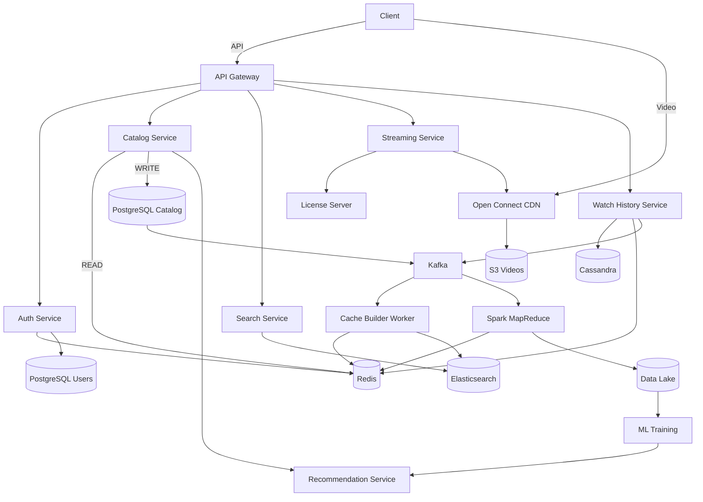
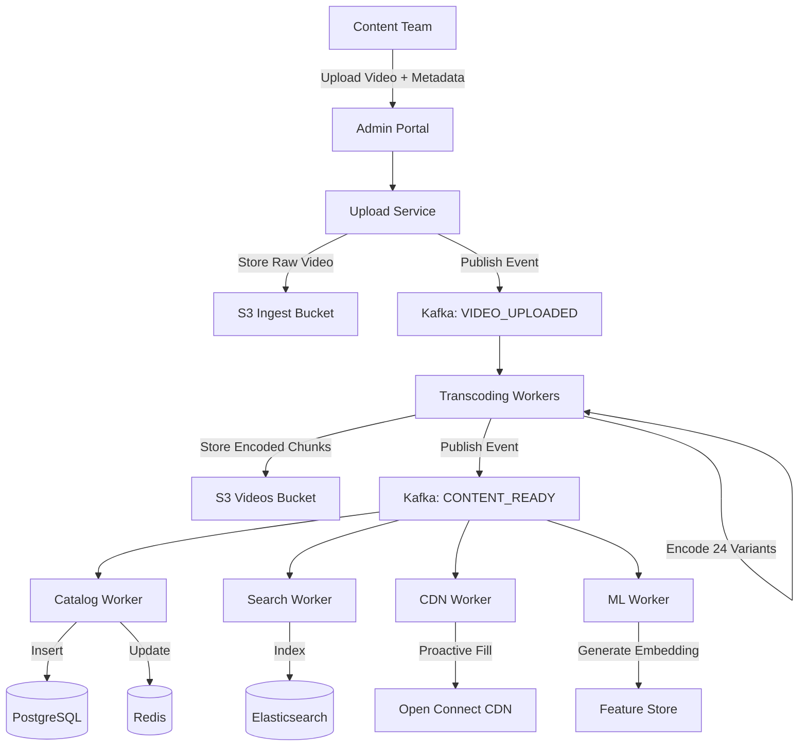
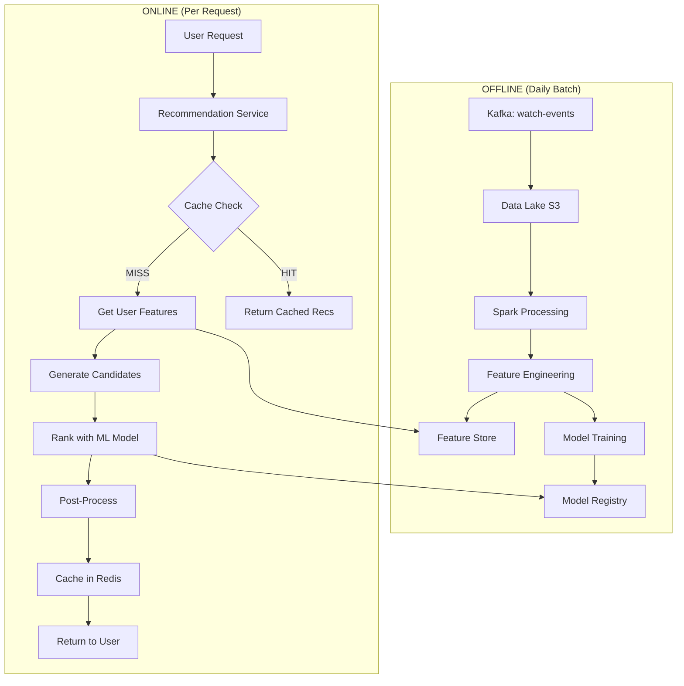
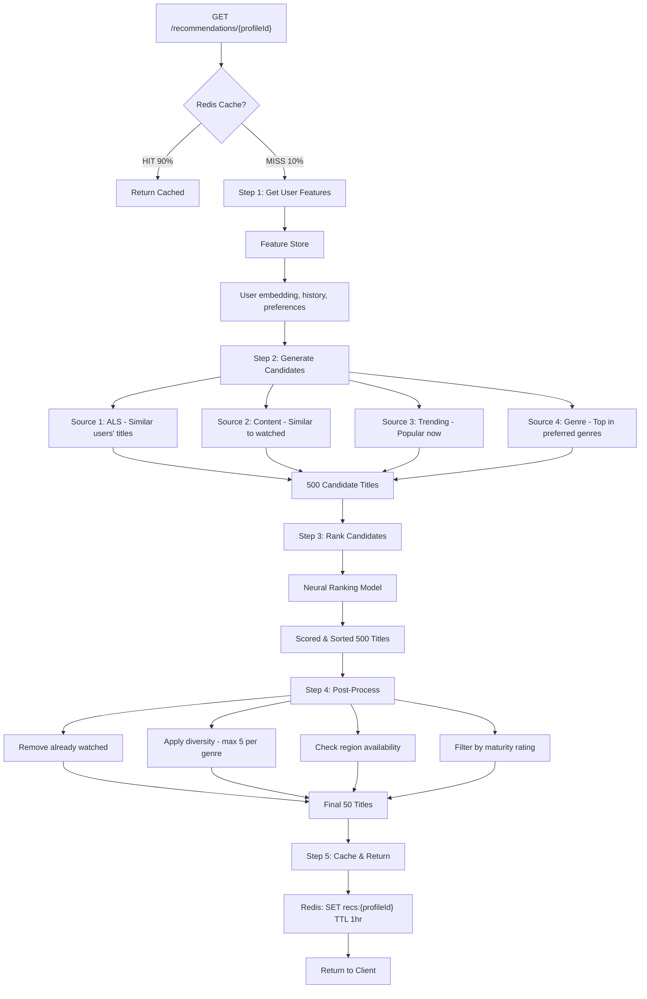
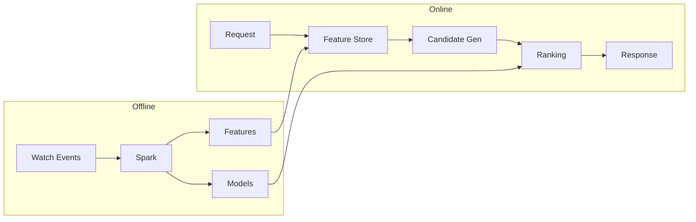

# Netflix Video Streaming — System Design

## 1. Functional Requirements

- User registration, login, profile management (multi-profile per account)
- Browse catalog: M genres, N titles per genre
- Search titles by name, actor, genre, director
- Stream video with adaptive bitrate (ABR)
- Track watch history and resume position
- Show trending titles per genre and globally
- Personalized recommendations
- A/B testing for UI and algorithm experiments

### Out of Scope

- Payments & subscription billing (separate bounded context)
- Social features (sharing, comments)
- Content upload by creators (admin-only ingestion)
- Offline downloads
- Parental controls
- Live streaming (sports, events)

---

## 2. Non-Functional Requirements

| NFR | Target | Linked FR | Reasoning |
|-----|--------|-----------|-----------|
| Availability | 99.99% | All | Revenue loss at scale ~$1M/min downtime |
| Catalog Latency | < 100ms p99 | Browse, Search | Users abandon after 3s, feed must be instant |
| Stream Start | < 2 seconds | Streaming | Industry benchmark, buffering = churn |
| Write Throughput | 115K writes/sec peak | Watch History | 100M DAU × 20 events/session, must not drop |
| Read Throughput | 18K QPS peak | Catalog Browse | Home feed loaded 3x/day per user |
| Scalability | Horizontal | All | 100M DAU today, design for 500M |
| Consistency — Auth | Strong | Login, Profile | Cannot serve wrong user's data |
| Consistency — Analytics | Eventual (≤5s) | Trending, History | 5s staleness acceptable for view counts |
| Durability | Zero data loss | Watch History, User Data | History is ML training input, cannot lose |
| Fault Tolerance | No SPOF | All | Region failure should not cause global outage |
| Security | DRM protected | Streaming | Content protection required by studios |
| Global Latency | < 50ms to edge | Streaming | CDN edge must be close to users |

---

## 3. Back of Envelope

### Users & Traffic

```
Total Users        = 300M
DAU                = 100M
Concurrent Users   = 10% of DAU = 10M (peak hour)
Avg Sessions/Day   = 2
Avg Session Length = 45 min
Regions            = 5 (NA, EU, APAC, LATAM, MEA)
```

### Read / Write QPS

```
--- Watch History Writes ---
Events per session       = 20 (progress update every 30s for 45 min ≈ 90, but batched to ~20)
Total events/day         = 100M users × 20 events = 2B events/day
Avg Write QPS            = 2,000,000,000 / 86,400 = ~23,148 QPS
Peak Write QPS (5x avg)  = 23,148 × 5 = ~115,000 QPS

--- Catalog Reads ---
Feed loads per user/day  = 3
Total reads/day          = 100M × 3 = 300M
Avg Read QPS             = 300,000,000 / 86,400 = ~3,472 QPS
Peak Read QPS (5x avg)   = 3,472 × 5 = ~17,360 QPS

--- Search ---
Searches per user/day    = 5
Total searches/day       = 100M × 5 = 500M
Avg Search QPS           = 500,000,000 / 86,400 = ~5,787 QPS
Peak Search QPS (5x avg) = 5,787 × 5 = ~28,935 QPS

--- API Gateway ---
Total Peak QPS           = 115K + 17K + 29K + misc = ~200K QPS
```

### Bandwidth

```
--- Streaming Egress ---
Concurrent streams       = 10M
Avg bitrate              = 5 Mbps (1080p adaptive average)
Total egress             = 10,000,000 × 5 Mbps = 50,000,000 Mbps = 50 Tbps

--- Chunk Serving ---
Chunk duration           = 4 seconds
Chunk size at 5 Mbps     = 5 × 4 / 8 = 2.5 MB per chunk
Chunks served per sec    = 10,000,000 / 4 = 2,500,000 chunks/sec

--- API Bandwidth ---
Avg API response         = 5 KB
Peak API QPS             = 200K QPS
API egress               = 200,000 × 5 KB = ~1 GB/sec = ~8 Gbps (negligible vs streaming)
```

### Storage

```
--- Catalog ---
Unique titles            = 50,000
Metadata per title       = 10 KB
Catalog total            = 50,000 × 10 KB = 500 MB (fits entirely in memory)

--- Video Files ---
Avg video length         = 1.5 hours
Resolutions              = 4 (480p, 720p, 1080p, 4K)
Codecs                   = 2 (H.264, H.265/HEVC)
Audio tracks             = 3 (stereo, 5.1, Atmos)
Total variants per title = 4 × 2 × 3 = 24
Avg size per variant     = 3 GB
Storage per title        = 24 × 3 GB = 72 GB
Total video storage      = 50,000 × 72 GB = 3,600,000 GB = 3.6 PB

--- Watch History ---
Record size              = 100 bytes
Records per day          = 2B
Retention                = 2 years (ML training requires long history)
Total history storage    = 2B × 730 × 100 bytes = 146 TB

--- User Data ---
Users                    = 300M
User record size         = 2 KB (profile, preferences, settings)
User storage             = 300M × 2 KB = 600 GB
```

### Cache Sizing

```
--- Catalog Cache ---
Working set              = 500 MB full catalog
Cache overhead           = 1.5x
Catalog cache            = 500 MB × 1.5 = 750 MB

--- Session Cache ---
Concurrent sessions      = 10M
Session size             = 500 bytes
Session cache            = 10M × 500 bytes = 5 GB

--- Trending Cache ---
Sorted sets              = 25 genres + 1 global = 26
Members per set          = 50,000 titles
Per member               = 50 bytes (titleId + score)
Trending cache           = 26 × 50,000 × 50 = 65 MB

--- Home Feed Cache ---
Concurrent users         = 10M
Feed cache hit rate      = 30% (rest served from sorted sets)
Cached feeds             = 3M feeds
Avg feed size            = 50 KB (25 genres × 20 titles × 100 bytes)
Home feed cache          = 3M × 50 KB = 150 GB

--- Resume Position Cache ---
Active users with resume = 50M
Positions per user       = 5 titles avg
Entry size               = 100 bytes
Resume cache             = 50M × 5 × 100 = 25 GB

--- Manifest Cache ---
Popular titles           = 5,000 (10% of catalog)
Manifest size            = 10 KB
Manifest cache           = 5,000 × 10 KB = 50 MB

Total Redis Memory       ≈ 750 MB + 5 GB + 65 MB + 150 GB + 25 GB + 50 MB ≈ 181 GB
```

### Summary

| Metric | Value |
|--------|-------|
| Concurrent Streams | 10M |
| Streaming Egress | 50 Tbps |
| Chunks/sec | 2.5M |
| Watch History Write QPS | 23K avg / 115K peak |
| Search QPS | 5.8K avg / 29K peak |
| Catalog Read QPS | 3.5K avg / 17K peak |
| API Gateway QPS | ~200K peak |
| Video Storage | 3.6 PB |
| Watch History Storage | 146 TB (2 years) |
| Catalog Size | 500 MB |
| Redis Cluster Total | ~181 GB |

---

## 4. API Design

### Versioning & Common Headers

```
Base URL: https://api.netflix.com/v1

Common Headers:
  Authorization: Bearer {token}
  X-Request-ID: {uuid}
  X-Device-Type: {mobile|web|tv}
  X-Experiment-IDs: {id1,id2}
```

### Auth

```
POST /v1/auth/signup
  Request:  { email, password, displayName }
  Response: { userId, accessToken, refreshToken, expiresIn }
  Status:   201 Created

POST /v1/auth/login
  Request:  { email, password, deviceId }
  Response: { accessToken, refreshToken, expiresIn, userId, profiles: [...] }
  Status:   200 OK

POST /v1/auth/refresh
  Request:  { refreshToken }
  Response: { accessToken, expiresIn }
  Status:   200 OK
```

### User & Profiles

```
GET /v1/users/{userId}/profiles
  Response: { profiles: [{ profileId, name, avatar, isKids, preferences }] }
  Status:   200 OK

PUT /v1/profiles/{profileId}/preferences
  Request:  { genres: [{genreId, weight}], maturityRating, audioLanguage }
  Response: { updated: true }
  Status:   200 OK
```

### Catalog

```
GET /v1/catalog/home?profileId={profileId}
  Response: {
    rows: [
      { rowId, rowType, title, titles: [{ titleId, title, thumbnailUrl, matchScore }] }
    ],
    experimentId: "home_layout_v3"
  }
  Status: 200 OK

GET /v1/catalog/genres/{genreId}?page=1&size=20&sort=popular
  Response: {
    genreId, genreName,
    titles: [{ titleId, title, rating, thumbnailUrl, releaseYear }],
    pagination: { page, size, totalPages, nextCursor }
  }
  Status: 200 OK

GET /v1/titles/{titleId}
  Response: {
    titleId, title, description, releaseYear, rating, durationSec,
    genres: [{ genreId, name }],
    cast: [{ personId, name, role }],
    episodes: [{ episodeId, seasonNum, episodeNum, title, durationSec }],
    similar: [{ titleId, title, matchScore }]
  }
  Status: 200 OK
```

### Search

```
GET /v1/search?q={query}&genre={genreId}&page=1&size=20
  Response: {
    results: [{ titleId, title, thumbnailUrl, matchScore, highlightedTitle }],
    suggestions: ["stranger things", "stranger"],
    pagination: { page, size, totalPages }
  }
  Status: 200 OK
```

### Streaming

```
GET /v1/stream/{titleId}/manifest?profileId={profileId}&episodeId={episodeId}
  Response: {
    playbackId: "uuid",
    manifestUrl: "https://oc.netflix.com/{signed-path}/master.m3u8",
    drmConfig: {
      widevine: { licenseUrl, certificateUrl },
      fairplay: { licenseUrl, certificateUrl },
      playready: { licenseUrl }
    },
    resumePositionSec: 1234,
    expiresAt: "2026-02-26T12:00:00Z"
  }
  Status: 200 OK

POST /v1/stream/{playbackId}/heartbeat
  Request:  { currentPositionSec, bitrateKbps, bufferHealthSec }
  Response: { continue: true }
  Status:   200 OK
```

### Watch History

```
POST /v1/profiles/{profileId}/history
  Request:  { titleId, episodeId?, progressSec, durationSec, timestamp }
  Response: { recorded: true }
  Status:   202 Accepted

GET /v1/profiles/{profileId}/continue-watching
  Response: {
    items: [{ titleId, title, thumbnailUrl, progressSec, durationSec, progressPercent }]
  }
  Status: 200 OK
```

### Trending & Recommendations

```
GET /v1/trending?genre={genreId}&window=24h&region={region}
  Response: {
    titles: [{ titleId, title, thumbnailUrl, viewCount, rank }]
  }
  Status: 200 OK

GET /v1/profiles/{profileId}/recommendations
  Response: {
    forYou: [{ titleId, title, thumbnailUrl, reason, score }],
    becauseYouWatched: [{ basedOn: { titleId, title }, titles: [...] }]
  }
  Status: 200 OK
```

---

## 5. Data Modeling & Indexing

### PostgreSQL — Users & Profiles (Sharded by user_id)

```sql
users (
  user_id         UUID PRIMARY KEY,
  email           VARCHAR(255) UNIQUE NOT NULL,
  password_hash   VARCHAR(255) NOT NULL,
  region          VARCHAR(10) NOT NULL,
  created_at      TIMESTAMP DEFAULT NOW()
)

profiles (
  profile_id      UUID PRIMARY KEY,
  user_id         UUID NOT NULL,
  name            VARCHAR(100) NOT NULL,
  avatar_url      VARCHAR(500),
  is_kids         BOOLEAN DEFAULT FALSE,
  maturity_rating VARCHAR(10) DEFAULT 'TV-MA'
)

profile_preferences (
  profile_id    UUID REFERENCES profiles(profile_id),
  genre_id      UUID,
  weight        FLOAT DEFAULT 1.0,
  PRIMARY KEY (profile_id, genre_id)
)

-- Indexes
CREATE INDEX idx_users_email ON users(email);
CREATE INDEX idx_profiles_user ON profiles(user_id);
```

### PostgreSQL — Catalog (Read Replicas, No Sharding)

```sql
genres (
  genre_id       UUID PRIMARY KEY,
  name           VARCHAR(100) UNIQUE NOT NULL,
  display_order  INT
)

titles (
  title_id       UUID PRIMARY KEY,
  title          VARCHAR(500) NOT NULL,
  description    TEXT,
  release_year   INT,
  rating         DECIMAL(3,1),
  duration_sec   INT,
  content_type   VARCHAR(20),
  maturity_rating VARCHAR(10),
  thumbnail_url  VARCHAR(1000),
  popularity_score FLOAT DEFAULT 0
)

title_genres (
  title_id  UUID REFERENCES titles(title_id),
  genre_id  UUID REFERENCES genres(genre_id),
  PRIMARY KEY (title_id, genre_id)
)

episodes (
  episode_id     UUID PRIMARY KEY,
  title_id       UUID REFERENCES titles(title_id),
  season_num     INT,
  episode_num    INT,
  episode_title  VARCHAR(500),
  duration_sec   INT,
  UNIQUE (title_id, season_num, episode_num)
)

-- Indexes
CREATE INDEX idx_title_genres_genre ON title_genres(genre_id);
CREATE INDEX idx_titles_popularity ON titles(popularity_score DESC);
CREATE INDEX idx_episodes_title ON episodes(title_id, season_num, episode_num);
```

### Cassandra — Watch History

```sql
-- Partition: (profile_id, year_month) to prevent hot partitions
CREATE TABLE watch_history (
  profile_id    UUID,
  year_month    TEXT,
  watched_at    TIMESTAMP,
  title_id      UUID,
  episode_id    UUID,
  progress_sec  INT,
  duration_sec  INT,
  completed     BOOLEAN,
  PRIMARY KEY ((profile_id, year_month), watched_at)
) WITH CLUSTERING ORDER BY (watched_at DESC)
  AND default_time_to_live = 63072000;

-- Resume position per title
CREATE TABLE watch_progress (
  profile_id    UUID,
  title_id      UUID,
  episode_id    UUID,
  progress_sec  INT,
  duration_sec  INT,
  updated_at    TIMESTAMP,
  PRIMARY KEY (profile_id, title_id)
);
```

### Redis Key Patterns

```
=== Session & Auth ===
session:{sessionId}              → JSON {userId, profileId, roles}     TTL 1h
refresh:{refreshToken}           → JSON {userId, deviceId}             TTL 30d

=== Catalog Read Path (CQRS) ===
catalog:genre:{genreId}          → SORTED SET {titleId → score}        No TTL
title:meta:{titleId}             → HASH {title, rating, thumbnailUrl}
home_feed:{profileId}            → JSON {serialized feed}              TTL 5m

=== Watch Progress ===
resume:{profileId}               → HASH {titleId → progressJson}       TTL 30d
continue:{profileId}             → LIST [titleId1, titleId2, ...]      TTL 7d

=== Streaming ===
manifest:{titleId}               → JSON {signed URLs, DRM config}      TTL 5m
playback:{playbackId}            → HASH {profileId, titleId, status}   TTL 4h

=== Trending ===
trending:global:24h              → SORTED SET {titleId → viewCount}    TTL 25h
trending:{genreId}:24h           → SORTED SET {titleId → viewCount}    TTL 25h

=== Rate Limiting ===
ratelimit:{endpoint}:{id}        → COUNT                               TTL varies
```

### Elasticsearch Index

```json
{
  "index": "titles",
  "settings": {
    "number_of_shards": 10,
    "number_of_replicas": 2
  },
  "mappings": {
    "properties": {
      "title_id":     { "type": "keyword" },
      "title":        { "type": "text", "analyzer": "standard" },
      "description":  { "type": "text" },
      "genres":       { "type": "keyword" },
      "actors":       { "type": "text" },
      "release_year": { "type": "integer" },
      "rating":       { "type": "float" },
      "popularity":   { "type": "float" },
      "suggest":      { "type": "completion" }
    }
  }
}
```

---

## 6. Sharding & Partitioning Strategy

| Component | Strategy | Key | Rationale | Hot Spot Mitigation |
|-----------|----------|-----|-----------|---------------------|
| Users DB (PG) | Hash shard | user_id | Even distribution | UUIDs distribute evenly |
| Catalog DB (PG) | No shard | — | 500 MB fits in memory | 10+ read replicas |
| Cassandra History | Composite partition | (profile_id, year_month) | Bounds partition size | Monthly bucket limits |
| Redis Cluster | Hash slots | Key prefix | Auto-distributed | Replicas for hot keys |
| Elasticsearch | Default sharding | — | Cross-genre searches | Query caching |
| Kafka | Topic-based | Varies | Different patterns | See below |
| S3 / CDN | Prefix-based | {hash}/{titleId}/ | Auto-partitions | Random prefix hash |

### Kafka Topics

| Topic | Partitions | Key | Use Case |
|-------|------------|-----|----------|
| watch-events | 256 | profileId | History writes, Analytics |
| catalog-updates | 16 | titleId | Cache invalidation |
| trending-aggregation | 64 | titleId | Trending computation |
| recommendation-events | 128 | profileId | ML feature updates |

---

## 7. High-Level Design (HLD)



---

## 8. HLD Walkthrough (Detailed Step-by-Step)

### Step 1 — User Opens App & Logs In

```
Client → GeoDNS → WAF → Rate Limiter → API Gateway → Auth Service → Redis/PostgreSQL
```

**Detailed Flow:**

1. **DNS Resolution:** Client app resolves `api.netflix.com` via GeoDNS (Route 53)
2. **Geographic Routing:** GeoDNS returns IP of nearest regional API endpoint (e.g., US-EAST for US users)
3. **Security Layer:** Request passes through WAF (Web Application Firewall) for DDoS protection and threat filtering
4. **Rate Limiting:** Redis checks `INCR ratelimit:login:{email}` — allows max 5 attempts per 15 minutes
5. **API Gateway:** Kong/Envoy validates request schema, extracts headers, routes to Auth Service
6. **Auth Service Processing:**
   - Fetch user by email from PostgreSQL: `SELECT * FROM users WHERE email = ?`
   - Verify password hash using bcrypt
   - Generate JWT access token (expires: 1 hour) with claims: `{userId, profileId, roles}`
   - Generate refresh token (expires: 30 days)
   - Create session in Redis: `SET session:{sessionId} {userId, deviceId, createdAt} EX 3600`
7. **Response:** Return `{accessToken, refreshToken, expiresIn, profiles[]}`

**Why This Design:**
- GeoDNS ensures lowest latency by routing to nearest region
- Rate limiting prevents brute force attacks
- JWT is stateless — services can validate without calling Auth Service
- Session in Redis enables forced logout across devices

---

### Step 2 — Home Feed Loads (CQRS Read Path)

```
Client → API Gateway → Catalog Service → Redis (NOT PostgreSQL) → Recommendation Service → Client
```

**Key Principle: The read path NEVER touches PostgreSQL. This is the CQRS pattern.**

---

#### 2.1 How Redis Gets Updated (Write Path - Background)

Before we discuss the read path, let's understand **how data gets INTO Redis** in the first place.

**Redis is NOT a cache in traditional sense — it's the PRIMARY READ STORE.**

```
WRITE PATH (runs when catalog changes):

Admin updates title
        │
        ▼
┌─────────────────┐
│ Catalog Service │
│   (Write API)   │
└────────┬────────┘
         │
         ▼
┌─────────────────┐
│   PostgreSQL    │  ← Source of Truth (normalized, ACID)
│    (Write)      │
└────────┬────────┘
         │
         ▼
┌─────────────────┐
│     Kafka       │  ← Event: "catalog-updated"
└────────┬────────┘
         │
         ▼
┌─────────────────┐
│  Cache Builder  │  ← Background Worker
│    Worker       │
└────────┬────────┘
         │
         ▼
┌─────────────────┐
│     Redis       │  ← Denormalized, optimized for reads
│  (Read Store)   │
└─────────────────┘
```

---

#### 2.2 Cache Builder Worker — The Key Component

This worker **transforms normalized PostgreSQL data into denormalized Redis structures**.

**When it runs:**
- On every `catalog-updated` Kafka event
- Scheduled full rebuild every 6 hours (consistency check)
- On startup/deployment

**What it does:**

```python
# CACHE BUILDER WORKER

def handle_catalog_update(event):
    """
    Triggered by Kafka event when admin updates catalog
    """
    title_id = event['titleId']
    event_type = event['eventType']  # CREATED | UPDATED | DELETED
    
    if event_type == 'DELETED':
        delete_title_from_redis(title_id)
    else:
        rebuild_title_in_redis(title_id)


def rebuild_title_in_redis(title_id):
    """
    Fetch from PostgreSQL, transform, write to Redis
    """
    
    # STEP 1: Fetch from PostgreSQL (Source of Truth)
    title = db.query("""
        SELECT t.title_id, t.title, t.rating, t.thumbnail_url, 
               t.content_type, t.release_year, t.popularity_score,
               array_agg(g.genre_id) as genres
        FROM titles t
        JOIN title_genres tg ON t.title_id = tg.title_id
        JOIN genres g ON tg.genre_id = g.genre_id
        WHERE t.title_id = %s
        GROUP BY t.title_id
    """, [title_id])
    
    # STEP 2: Update title metadata hash
    redis.hset(f"title:meta:{title_id}", mapping={
        "title": title.title,
        "rating": title.rating,
        "thumbnailUrl": title.thumbnail_url,
        "contentType": title.content_type,
        "releaseYear": title.release_year
    })
    
    # STEP 3: Update genre sorted sets
    for genre_id in title.genres:
        # Score = popularity (higher = shown first)
        redis.zadd(
            f"catalog:genre:{genre_id}",
            {title_id: title.popularity_score}
        )
    
    # STEP 4: Invalidate user home feeds (they'll rebuild on next request)
    # Option A: Delete all (simple but expensive)
    # Option B: Let TTL expire naturally (5 min)
    # Option C: Publish invalidation event for affected users
    

def rebuild_full_catalog():
    """
    Full rebuild - runs every 6 hours or on deployment
    """
    
    # STEP 1: Fetch ALL titles from PostgreSQL
    titles = db.query("""
        SELECT t.*, array_agg(tg.genre_id) as genres
        FROM titles t
        JOIN title_genres tg ON t.title_id = tg.title_id
        GROUP BY t.title_id
    """)
    
    # STEP 2: Clear old Redis data
    for genre_id in get_all_genres():
        redis.delete(f"catalog:genre:{genre_id}")
    
    # STEP 3: Rebuild all structures
    pipeline = redis.pipeline()
    
    for title in titles:
        # Title metadata
        pipeline.hset(f"title:meta:{title.title_id}", mapping={
            "title": title.title,
            "rating": title.rating,
            "thumbnailUrl": title.thumbnail_url,
            "contentType": title.content_type,
            "releaseYear": title.release_year
        })
        
        # Genre sorted sets
        for genre_id in title.genres:
            pipeline.zadd(
                f"catalog:genre:{genre_id}",
                {title.title_id: title.popularity_score}
            )
    
    # STEP 4: Execute all commands in one batch
    pipeline.execute()
    
    print(f"Rebuilt {len(titles)} titles in Redis")
```

---

#### 2.3 Redis Data Structures (What Gets Built)

**Structure 1: Genre Sorted Sets**

```
Key: catalog:genre:action
Type: Sorted Set
Score: popularity_score (higher = more popular)

┌─────────────┬───────────────┐
│   titleId   │     score     │
├─────────────┼───────────────┤
│  title_001  │    95000.0    │  ← Most popular action title
│  title_042  │    87500.0    │
│  title_107  │    82300.0    │
│  title_023  │    79100.0    │
│     ...     │      ...      │
│  title_892  │     1200.0    │  ← Least popular
└─────────────┴───────────────┘

Commands:
  ZADD catalog:genre:action 95000 title_001    # Add/update
  ZREVRANGE catalog:genre:action 0 19          # Get top 20
  ZREM catalog:genre:action title_001          # Remove
```

**Structure 2: Title Metadata Hashes**

```
Key: title:meta:title_001
Type: Hash

┌─────────────────┬──────────────────────────────┐
│      field      │            value             │
├─────────────────┼──────────────────────────────┤
│  title          │  "Stranger Things"           │
│  rating         │  "8.7"                       │
│  thumbnailUrl   │  "https://cdn.../thumb.jpg"  │
│  contentType    │  "SERIES"                    │
│  releaseYear    │  "2016"                      │
│  maturityRating │  "TV-14"                     │
└─────────────────┴──────────────────────────────┘

Commands:
  HSET title:meta:title_001 title "Stranger Things" rating "8.7" ...
  HGETALL title:meta:title_001    # Get all fields
  HGET title:meta:title_001 title # Get single field
```

**Structure 3: User Home Feed Cache**

```
Key: home_feed:profile_abc123
Type: String (JSON)
TTL: 300 seconds (5 minutes)

Value: {
  "rows": [
    {
      "rowType": "continue_watching",
      "titles": [{"titleId": "t1", "title": "...", "progress": 45}]
    },
    {
      "rowType": "genre",
      "genreId": "action", 
      "genreName": "Action",
      "titles": [{"titleId": "t2", "title": "...", "matchScore": 95}]
    }
  ],
  "generatedAt": "2026-02-26T10:00:00Z",
  "experimentId": "home_v3"
}

Commands:
  SET home_feed:profile_abc123 '{...}' EX 300
  GET home_feed:profile_abc123
```

---

#### 2.4 The Complete CQRS Flow (Visual)

```
┌─────────────────────────────────────────────────────────────────────────────┐
│                              WRITE PATH                                      │
│                         (When catalog changes)                               │
│                                                                              │
│  Admin ──▶ Catalog Service ──▶ PostgreSQL ──▶ Kafka ──▶ Cache Builder ──▶ Redis
│                                    │                         │               │
│                              (Source of                 (Transforms    (Denormalized
│                               Truth)                     data)          Read Store)
└─────────────────────────────────────────────────────────────────────────────┘

┌─────────────────────────────────────────────────────────────────────────────┐
│                              READ PATH                                       │
│                         (When user loads feed)                               │
│                                                                              │
│  Client ──▶ Catalog Service ──▶ Redis ──▶ Client                            │
│                                   │                                          │
│                            (PostgreSQL is                                    │
│                             NEVER touched)                                   │
└─────────────────────────────────────────────────────────────────────────────┘
```

---

#### 2.5 Detailed Read Flow (Now That You Know How Redis is Populated)

1. **Request:** `GET /v1/catalog/home?profileId=abc123`

2. **L1 Cache Check (User's Personalized Feed):**
   ```
   Redis: GET home_feed:{profileId}
   ```
   - **HIT (30% of requests):** Return immediately in ~1ms, skip all steps below
   - **MISS:** Continue to L2

3. **L2 — Fetch Genre Rows from Redis Sorted Sets:**
   ```
   Redis PIPELINE (single round trip for all 25 genres):
     ZREVRANGE catalog:genre:action 0 19 WITHSCORES
     ZREVRANGE catalog:genre:comedy 0 19 WITHSCORES
     ZREVRANGE catalog:genre:drama 0 19 WITHSCORES
     ... (25 total genres)
   ```
   - Returns top 20 titleIds per genre, already sorted by popularity score
   - Total: 25 genres × 20 titles = 500 titleIds
   - **This data was pre-built by Cache Builder Worker!**

4. **Hydrate Title Metadata:**
   ```
   Redis PIPELINE (single round trip for all titles):
     HGETALL title:meta:title001
     HGETALL title:meta:title002
     ... (500 titles)
   ```
   - Each hash contains: `{title, rating, thumbnailUrl, contentType, releaseYear, maturityRating}`
   - **This data was pre-built by Cache Builder Worker!**

5. **Fetch User Preferences:**
   ```
   Redis: HGETALL profile:prefs:{profileId}
   ```
   - Returns: `{action: 1.5, comedy: 0.8, drama: 1.2, ...}` (genre weights)

6. **Personalization (Recommendation Service):**
   - Call Recommendation Service with user's watch history embedding
   - Re-rank titles within each genre based on:
     - User preference weights
     - Collaborative filtering score
     - Content-based similarity
   - Add "Because You Watched X" row
   - Apply A/B test variant (e.g., different row ordering)

7. **Fetch Continue Watching:**
   ```
   Redis: LRANGE continue:{profileId} 0 9
   Redis: HGETALL resume:{profileId}
   ```
   - Get list of recently watched titles with progress

8. **Assemble Final Feed:**
   ```json
   {
     "rows": [
       { "rowType": "continue_watching", "titles": [...] },
       { "rowType": "trending", "titles": [...] },
       { "rowType": "genre", "genreName": "Action", "titles": [...] },
       { "rowType": "because_you_watched", "basedOn": "Stranger Things", "titles": [...] }
     ],
     "experimentId": "home_layout_v3"
   }
   ```

9. **Cache Personalized Feed:**
   ```
   Redis: SET home_feed:{profileId} {serializedFeed} EX 300
   ```
   - TTL 5 minutes — balances freshness vs cache hit rate

10. **Return Response:** ~5-15ms total (vs 200-500ms if hitting PostgreSQL)

---

#### 2.6 Why Not Just Use PostgreSQL with Caching?

| Approach | Problem |
|----------|---------|
| **PostgreSQL + Simple Cache** | Cache miss = slow query, cache stampede on expiry |
| **PostgreSQL + Read Replicas** | Still doing JOINs, still slow at 17K QPS |
| **Redis as Cache (TTL-based)** | Data expires, miss = hit PostgreSQL |
| **Redis as Read Store (CQRS)** | ✅ Data always present, never hit PostgreSQL on reads |

**CQRS Advantages:**
1. **No cache miss** — Redis always has data (background sync)
2. **No JOIN queries** — Data pre-denormalized
3. **No thundering herd** — TTL expiry doesn't cause DB spike
4. **Independent scaling** — Read and write paths scale separately

---

#### 2.7 What Happens When PostgreSQL and Redis Are Out of Sync?

**Scenario:** Admin updates title, but Kafka/Worker fails before Redis update

**Detection:**
- Scheduled consistency checker (every 6 hours)
- Compares PostgreSQL row counts and checksums with Redis

**Resolution:**
- Full rebuild triggered automatically
- Alert sent to ops team

**User Impact:**
- Stale data for max 6 hours (acceptable for catalog)
- Critical paths (auth, payments) use strong consistency, not CQRS

```python
# Consistency Checker (runs every 6 hours)
def check_consistency():
    pg_count = db.query("SELECT COUNT(*) FROM titles")[0]
    
    redis_count = 0
    for genre in get_all_genres():
        redis_count += redis.zcard(f"catalog:genre:{genre}")
    
    # Dedupe since titles can be in multiple genres
    redis_titles = set()
    for genre in get_all_genres():
        redis_titles.update(redis.zrange(f"catalog:genre:{genre}", 0, -1))
    
    if len(redis_titles) != pg_count:
        alert("Redis/PostgreSQL mismatch!")
        trigger_full_rebuild()
```

**Why This Design:**

| Approach | Queries | Latency | DB Load at 17K QPS |
|----------|---------|---------|-------------------|
| Naive (PostgreSQL) | 25 JOINed SQL queries | 200-500ms | 425K queries/sec |
| CQRS (Redis) | 2 pipelined Redis calls | 5-15ms | 0 SQL queries |

---

### Step 3 — User Searches for Content

```
Client → API Gateway → Search Service → Elasticsearch → Client
```

**Detailed Flow:**

1. **Request:** `GET /v1/search?q=stranger&page=1&size=20`

2. **Query Preprocessing:**
   - Lowercase: "stranger"
   - Spell check: Check if "stranger" is misspelled (e.g., "straner" → "stranger")
   - Tokenize for autocomplete

3. **Elasticsearch Query:**
   ```json
   {
     "query": {
       "bool": {
         "should": [
           { "match": { "title": { "query": "stranger", "boost": 3.0, "fuzziness": "AUTO" } } },
           { "match": { "actors": { "query": "stranger", "boost": 2.0 } } },
           { "match": { "description": { "query": "stranger", "boost": 1.0 } } },
           { "term": { "tags": { "value": "stranger", "boost": 1.5 } } }
         ],
         "filter": [
           { "terms": { "region_availability": ["US"] } },
           { "range": { "maturity_rating": { "lte": "TV-MA" } } }
         ]
       }
     },
     "suggest": {
       "title-suggest": {
         "prefix": "stranger",
         "completion": { "field": "suggest", "size": 5 }
       }
     },
     "from": 0,
     "size": 20,
     "sort": [
       { "_score": "desc" },
       { "popularity": "desc" }
     ]
   }
   ```

4. **Result Processing:**
   - Extract titleIds from hits
   - Fetch full metadata from Redis (if needed)
   - Highlight matched terms in title

5. **Response:**
   ```json
   {
     "results": [
       { "titleId": "t001", "title": "Stranger Things", "matchScore": 95.2, "highlightedTitle": "<em>Stranger</em> Things" },
       { "titleId": "t002", "title": "The Stranger", "matchScore": 87.1 }
     ],
     "suggestions": ["stranger things", "stranger 2020"],
     "spellCheck": null,
     "pagination": { "page": 1, "totalPages": 3, "totalItems": 47 }
   }
   ```

**Why Elasticsearch over PostgreSQL LIKE:**
- Fuzzy matching (handles typos)
- Relevance scoring (not just matching)
- Autocomplete suggestions
- 30K QPS with sub-100ms latency

---

### Step 4 — User Clicks Play (Streaming)

```
Client → API Gateway → Streaming Service → Redis/S3 → License Server → Client
Client → Open Connect CDN → S3 (origin)
```

**4a. Manifest Request (What happens when you click play):**

1. **Request:** `GET /v1/stream/{titleId}/manifest?profileId=abc&episodeId=ep01`

2. **Entitlement Check:**
   - Verify subscription is active (call User Service or check JWT claims)
   - Verify content is available in user's region
   - Check concurrent stream limit (max 4 screens)

3. **Check Manifest Cache:**
   ```
   Redis: GET manifest:{titleId}
   ```
   - **HIT:** Return cached manifest (90% of requests)
   - **MISS:** Build manifest

4. **Build Manifest (on cache miss):**
   
   a. **Fetch manifest template from S3:**
   ```
   S3: GET s3://netflix-manifests/{titleId}/master.m3u8
   ```
   
   b. **Generate signed CDN URLs:**
   ```
   For each resolution (480p, 720p, 1080p, 4K):
     signedUrl = sign(cdnUrl, secretKey, expiry=5min)
   ```
   
   c. **Get DRM license URLs:**
   ```
   widevine: https://license.netflix.com/widevine/{titleId}
   fairplay: https://license.netflix.com/fairplay/{titleId}
   playready: https://license.netflix.com/playready/{titleId}
   ```

5. **Fetch Resume Position:**
   ```
   Redis: HGET resume:{profileId} {titleId}
   ```
   - Returns: `{episodeId: "ep01", progressSec: 1847, updatedAt: "..."}`

6. **Cache Manifest:**
   ```
   Redis: SET manifest:{titleId} {manifestJson} EX 300
   ```

7. **Response:**
   ```json
   {
     "playbackId": "pb-uuid-123",
     "manifestUrl": "https://oc.netflix.com/signed/title123/master.m3u8?token=xxx&expires=1709900000",
     "drmConfig": {
       "widevine": { "licenseUrl": "https://license.netflix.com/widevine/title123", "certificateUrl": "..." },
       "fairplay": { "licenseUrl": "https://license.netflix.com/fairplay/title123", "certificateUrl": "..." }
     },
     "resumePositionSec": 1847,
     "expiresAt": "2026-02-26T12:05:00Z",
     "availableQualities": ["480p", "720p", "1080p", "4K"]
   }
   ```

**4b. What is a Manifest?**

A manifest is a playlist file that tells the video player which chunks to fetch:

```
#EXTM3U
#EXT-X-STREAM-INF:BANDWIDTH=800000,RESOLUTION=640x360
https://oc.netflix.com/title123/360p/playlist.m3u8
#EXT-X-STREAM-INF:BANDWIDTH=2800000,RESOLUTION=1280x720
https://oc.netflix.com/title123/720p/playlist.m3u8
#EXT-X-STREAM-INF:BANDWIDTH=5000000,RESOLUTION=1920x1080
https://oc.netflix.com/title123/1080p/playlist.m3u8
```

Each quality level has its own playlist listing 4-second chunks:
```
#EXTM3U
#EXT-X-TARGETDURATION:4
#EXTINF:4.0,
https://oc.netflix.com/title123/1080p/chunk_001.ts
#EXTINF:4.0,
https://oc.netflix.com/title123/1080p/chunk_002.ts
```

**4c. DRM License Acquisition:**

1. **Client requests license:**
   ```
   POST https://license.netflix.com/widevine/title123
   Body: { challenge: <encrypted_challenge>, sessionToken: <jwt> }
   ```

2. **License Server validates:**
   - JWT signature and expiry
   - User's subscription tier (Basic: 480p, Standard: 1080p, Premium: 4K)
   - Device security level (Widevine L1 = hardware, L3 = software)

3. **License Server responds:**
   - Returns encrypted content keys
   - Keys valid for 24 hours (offline) or session duration (streaming)

**4d. Video Chunk Fetching (ABR - Adaptive Bitrate):**

1. **Client parses manifest**
2. **Initial quality selection:** Based on detected bandwidth, start at appropriate quality
3. **Fetch chunks from Open Connect CDN:**
   ```
   GET https://oc.netflix.com/title123/1080p/chunk_001.ts
   ```

4. **CDN Routing (Open Connect):**
   - Steering Service determines optimal OCA (Open Connect Appliance)
   - OCA in user's ISP serves chunk (~95% cache hit rate)
   - On miss: OCA fetches from regional hub → S3 origin

5. **Adaptive Bitrate Switching:**
   - Client monitors download speed and buffer health
   - If bandwidth drops: switch to lower quality (720p → 480p)
   - If bandwidth improves: switch to higher quality (720p → 1080p)
   - Seamless switching happens at chunk boundaries

**4e. Heartbeat (Every 30 seconds during playback):**

```
POST /v1/stream/{playbackId}/heartbeat
{ currentPositionSec: 1890, bitrateKbps: 5000, bufferHealthSec: 30, quality: "1080p" }
```

- Validates session is still active
- Updates `playback:{playbackId}` TTL in Redis
- Feeds real-time analytics (concurrent viewers, quality distribution)
- Returns `{ continue: true }` or `{ continue: false, reason: "concurrent_limit" }`

---

### Step 5 — Progress Tracking (Watch History)

```
Client → API Gateway → Watch History Service → Cassandra → Redis → Kafka
```

**When it happens:** Every 30 seconds during playback + on pause/exit

**Detailed Flow:**

1. **Request:** 
   ```
   POST /v1/profiles/{profileId}/history
   {
     "titleId": "title123",
     "episodeId": "ep01",
     "progressSec": 1890,
     "durationSec": 3600,
     "timestamp": "2026-02-26T10:30:00Z",
     "completed": false
   }
   ```

2. **Step 1 — Write to Cassandra FIRST (Source of Truth):**
   ```sql
   -- Write to watch_progress (for resume)
   INSERT INTO watch_progress (profile_id, title_id, episode_id, progress_sec, duration_sec, updated_at)
   VALUES (?, ?, ?, ?, ?, ?)
   USING TTL 63072000;  -- 2 years
   
   -- Write to watch_history (for history list)
   INSERT INTO watch_history (profile_id, year_month, watched_at, title_id, episode_id, progress_sec, duration_sec, completed)
   VALUES (?, '2026-02', ?, ?, ?, ?, ?, ?);
   ```
   - Consistency Level: LOCAL_QUORUM (2 of 3 replicas must acknowledge)
   - **If Cassandra write fails:** Return 503, client retries with exponential backoff
   - **If Cassandra write succeeds:** Continue to next steps

3. **Step 2 — Update Redis Cache (Best Effort):**
   ```
   HSET resume:{profileId} {titleId} '{"episodeId":"ep01","progressSec":1890,"updatedAt":"..."}'
   
   -- Update continue watching list (most recent first)
   LREM continue:{profileId} 0 {titleId}  -- Remove if exists
   LPUSH continue:{profileId} {titleId}   -- Add to front
   LTRIM continue:{profileId} 0 19        -- Keep only 20 items
   ```
   - **If Redis fails:** Log error, DO NOT fail the request
   - Background reconciliation job rebuilds cache from Cassandra if needed

4. **Step 3 — Publish to Kafka (Fire and Forget):**
   ```json
   Topic: watch-events
   Key: profileId (ensures ordering per user)
   Value: {
     "eventType": "PROGRESS",
     "profileId": "abc123",
     "titleId": "title123",
     "episodeId": "ep01",
     "progressSec": 1890,
     "timestamp": "2026-02-26T10:30:00Z",
     "deviceType": "web",
     "quality": "1080p"
   }
   ```
   - Producer acks: 1 (leader only — acceptable for analytics)
   - **If Kafka publish fails:** Log error, continue (analytics can tolerate gaps)

5. **Response:** `202 Accepted` with `{ "recorded": true }`

**Why This Order (Cassandra → Redis → Kafka):**

| Store | Role | Failure Impact |
|-------|------|----------------|
| Cassandra | Source of truth | Must succeed, retry if fails |
| Redis | Read cache | Can rebuild from Cassandra |
| Kafka | Analytics | Can tolerate gaps |

---

### Step 6 — Trending Computation (Async Workers)

```
Kafka → Trending Workers → Redis Sorted Sets
```

**Detailed Flow:**

1. **Kafka Consumer Group:** `trending-workers` (10 consumers, 64 partitions)

2. **For each watch event:**
   ```
   Redis PIPELINE:
     ZINCRBY trending:global:24h 1 {titleId}
     ZINCRBY trending:{genreId}:24h 1 {titleId}
     ZINCRBY trending:{region}:24h 1 {titleId}
   ```

3. **Sliding Window Implementation:**
   - Separate sorted sets for each window: `trending:global:1h`, `trending:global:24h`, `trending:global:7d`
   - Each set has TTL slightly longer than window (e.g., 25h for 24h window)
   - Old events naturally expire

4. **When User Requests Trending:**
   ```
   GET /v1/trending?window=24h&genre=action&region=US
   
   Redis: ZREVRANGE trending:action:24h 0 49 WITHSCORES
   ```
   - Returns top 50 titles with view counts
   - O(log N + K) complexity where K = result size

5. **Movement Calculation (Optional):**
   - Compare current rank with rank 1 hour ago
   - Add "↑5" or "↓3" movement indicators

---

### Step 6.1 — MapReduce & Aggregation (Where It's Used)

MapReduce is used for **batch processing** where real-time Redis counters aren't sufficient.

**Use Cases in Netflix System:**

| Use Case | Why MapReduce? | Real-time Alternative |
|----------|----------------|----------------------|
| Daily trending reports | Need exact counts, not approximations | Redis ZINCRBY (approximate) |
| Genre popularity by region | Complex grouping across dimensions | Too many Redis keys |
| User cohort analysis | Aggregate millions of users | Not feasible in real-time |
| ML feature generation | Process 2B events/day | Streaming can't handle |
| Content performance reports | Historical analysis | Redis TTL expires data |
| Recommendation training | Full dataset joins | Memory constraints |

---

#### 6.1.1 Trending Aggregation with MapReduce (Spark)

**When:** Daily batch job at 2 AM (complements real-time Redis)

**Input:** Kafka watch-events → S3 Data Lake (Parquet files)

```
Day's events in S3:
s3://netflix-events/2026/02/26/watch-events/*.parquet
```

**MapReduce Job (Spark):**

```python
# MAP PHASE: Extract (titleId, 1) pairs
def map_watch_event(event):
    return (event.titleId, 1)

# REDUCE PHASE: Sum counts per title
def reduce_counts(a, b):
    return a + b

# SPARK IMPLEMENTATION
from pyspark.sql import SparkSession
from pyspark.sql.functions import count, col, dense_rank
from pyspark.sql.window import Window

spark = SparkSession.builder.appName("TrendingAggregation").getOrCreate()

# Read day's events
events = spark.read.parquet("s3://netflix-events/2026/02/26/")

# MAP-REDUCE: Count views per title
trending = events \
    .groupBy("titleId", "genreId", "region") \
    .agg(count("*").alias("viewCount"))

# RANK within each genre
window = Window.partitionBy("genreId").orderBy(col("viewCount").desc())
ranked = trending.withColumn("rank", dense_rank().over(window))

# OUTPUT: Top 100 per genre
top_trending = ranked.filter(col("rank") <= 100)

# Write to S3 for reporting
top_trending.write.parquet("s3://netflix-analytics/trending/2026-02-26/")

# Also update Redis for serving (more accurate than real-time)
for row in top_trending.collect():
    redis.zadd(f"trending:daily:{row.genreId}", {row.titleId: row.viewCount})
```

**Output:**
```
+----------+--------+--------+-----------+------+
| titleId  | genreId| region | viewCount | rank |
+----------+--------+--------+-----------+------+
| title001 | action | US     | 2,847,293 | 1    |
| title042 | action | US     | 1,923,847 | 2    |
| title007 | comedy | US     | 3,102,847 | 1    |
+----------+--------+--------+-----------+------+
```

---

#### 6.1.2 Regional Content Performance (Complex Aggregation)

**Question:** "What's the completion rate per genre per region per device type?"

**Why MapReduce:** 3-dimensional grouping with 50K titles × 5 regions × 25 genres × 4 devices = millions of combinations

```python
# Multi-dimensional aggregation
performance = events \
    .groupBy("region", "genreId", "deviceType") \
    .agg(
        count("*").alias("totalViews"),
        sum(when(col("completed") == True, 1).otherwise(0)).alias("completions"),
        avg("progressPercent").alias("avgProgress"),
        countDistinct("profileId").alias("uniqueViewers")
    ) \
    .withColumn("completionRate", col("completions") / col("totalViews"))

# Result: Which genres perform best on which devices in which regions?
# e.g., "Action movies have 78% completion on TV in US but only 45% on mobile in APAC"
```

---

#### 6.1.3 User Cohort Analysis (ML Features)

**Question:** "Group users by behavior patterns for recommendation training"

```python
# Step 1: Aggregate user behavior
user_features = events \
    .groupBy("profileId") \
    .agg(
        count("*").alias("totalWatches"),
        countDistinct("titleId").alias("uniqueTitles"),
        avg("sessionDuration").alias("avgSessionMin"),
        collect_set("genreId").alias("watchedGenres"),
        
        # Genre affinity scores
        sum(when(col("genreId") == "action", col("watchTime")).otherwise(0)).alias("actionTime"),
        sum(when(col("genreId") == "comedy", col("watchTime")).otherwise(0)).alias("comedyTime"),
        sum(when(col("genreId") == "drama", col("watchTime")).otherwise(0)).alias("dramaTime")
    )

# Step 2: Create user embeddings
user_embeddings = user_features \
    .withColumn("genreVector", array(
        col("actionTime") / col("totalWatchTime"),
        col("comedyTime") / col("totalWatchTime"),
        col("dramaTime") / col("totalWatchTime")
        # ... 25 genres
    ))

# Step 3: Output to Feature Store for ML
user_embeddings.write.format("delta").save("s3://feature-store/user-embeddings/")
```

---

#### 6.1.4 Recommendation Model Training (ALS MapReduce)

**Collaborative Filtering with Alternating Least Squares (ALS):**

```python
from pyspark.ml.recommendation import ALS

# Create user-item interaction matrix
interactions = events \
    .groupBy("profileId", "titleId") \
    .agg(
        # Implicit feedback: watch time as rating
        sum("watchTimeMinutes").alias("rating")
    )

# MAP-REDUCE inside ALS:
# - MAP: Distribute user-item pairs across nodes
# - REDUCE: Compute matrix factorization iteratively

als = ALS(
    maxIter=10,
    regParam=0.01,
    userCol="profileId",
    itemCol="titleId",
    ratingCol="rating",
    implicitPrefs=True,  # Implicit feedback (views, not explicit ratings)
    coldStartStrategy="drop"
)

# Train model (internally uses MapReduce)
model = als.fit(interactions)

# Generate recommendations for all users
userRecs = model.recommendForAllUsers(50)  # Top 50 per user

# Output: Pre-computed recommendations
userRecs.write.parquet("s3://recommendations/als/2026-02-26/")
```

**ALS MapReduce Internals:**
```
Iteration 1:
  MAP:    Distribute users across nodes, fix item factors
  REDUCE: Update user factors (solve least squares)

Iteration 2:
  MAP:    Distribute items across nodes, fix user factors  
  REDUCE: Update item factors (solve least squares)

... repeat for 10 iterations until convergence
```

---

#### 6.1.5 Real-time vs Batch: When to Use What

| Scenario | Use Real-time (Redis/Kafka) | Use Batch (MapReduce/Spark) |
|----------|----------------------------|----------------------------|
| Current trending | ✅ ZINCRBY | ❌ Too slow |
| Resume position | ✅ Redis HSET | ❌ Overkill |
| Daily reports | ❌ Data expires | ✅ Historical analysis |
| ML training | ❌ Memory limits | ✅ Process full dataset |
| Complex aggregations | ❌ Too many keys | ✅ Multi-dimensional |
| User embeddings | ❌ Can't compute | ✅ Full behavior history |
| A/B test analysis | ❌ Approximate | ✅ Statistical rigor |

---

#### 6.1.6 Lambda Architecture (Best of Both)

Netflix uses **Lambda Architecture**: Real-time + Batch layers

```
                    ┌─────────────────────────────────────┐
                    │           SERVING LAYER             │
                    │  (Redis - merged real-time + batch) │
                    └─────────────────────────────────────┘
                                    ▲
                    ┌───────────────┴───────────────┐
                    │                               │
        ┌───────────────────┐           ┌───────────────────┐
        │   SPEED LAYER     │           │   BATCH LAYER     │
        │   (Real-time)     │           │   (MapReduce)     │
        │                   │           │                   │
        │ Kafka → Redis     │           │ S3 → Spark → S3   │
        │ ZINCRBY counters  │           │ Exact aggregates  │
        │ ~1 sec latency    │           │ ~1 hour latency   │
        │ Approximate       │           │ Accurate          │
        └───────────────────┘           └───────────────────┘
                    ▲                               ▲
                    │                               │
                    └───────────────┬───────────────┘
                                    │
                            ┌───────────────┐
                            │    Kafka      │
                            │ (Event Stream)│
                            └───────────────┘
```

**How it works:**
1. **Speed Layer:** Kafka → Redis for real-time approximate counts
2. **Batch Layer:** Kafka → S3 → Spark for daily accurate counts
3. **Serving Layer:** Merge both — use batch as baseline, speed for recent delta

```python
# Serving layer merge
def get_trending(genre, window="24h"):
    if window == "24h":
        # Real-time is accurate enough
        return redis.zrevrange(f"trending:{genre}:24h", 0, 49)
    elif window == "7d":
        # Merge batch (accurate) + speed (recent)
        batch_counts = redis.zrevrange(f"trending:batch:{genre}:7d", 0, 49, withscores=True)
        speed_counts = redis.zrevrange(f"trending:speed:{genre}:24h", 0, 49, withscores=True)
        
        # Merge: batch baseline + recent speed delta
        merged = {}
        for title, score in batch_counts:
            merged[title] = score
        for title, score in speed_counts:
            merged[title] = merged.get(title, 0) + score
        
        return sorted(merged.items(), key=lambda x: -x[1])[:50]
```

---

### Step 7 — Content Ingestion (Admin/Async)

#### 7.1 Content Upload Flow



#### 7.2 Step-by-Step Explanation

| Step | Component | What Happens |
|------|-----------|--------------|
| 1 | Content Team | Uploads 4K master video + metadata (title, cast, genres, regions) via Admin Portal |
| 2 | Upload Service | Validates file format, generates titleId, stores raw video in S3 Ingest bucket |
| 3 | Kafka | Publishes `VIDEO_UPLOADED` event to trigger transcoding |
| 4 | Transcoding Workers | Encodes video into 24 variants (4 resolutions × 2 codecs × 3 audio tracks) |
| 5 | Transcoding Workers | Splits each variant into 4-second chunks, encrypts with DRM |
| 6 | Transcoding Workers | Generates HLS manifests, stores everything in S3 Videos bucket |
| 7 | Kafka | Publishes `CONTENT_READY` event when encoding completes |
| 8 | Catalog Worker | Inserts title into PostgreSQL, updates Redis sorted sets |
| 9 | Search Worker | Indexes title in Elasticsearch for search |
| 10 | CDN Worker | Pushes popular content to Open Connect appliances (proactive fill) |
| 11 | ML Worker | Generates content embedding, stores in Feature Store for recommendations |

#### 7.3 Transcoding Details

```
Input:  source.mp4 (4K master, ~50GB)

Output: 24 variants
        ├── 4 Resolutions: 480p, 720p, 1080p, 4K
        ├── 2 Codecs: H.264 (compatibility), H.265 (quality)
        └── 3 Audio: Stereo, 5.1 Surround, Dolby Atmos

Processing:
        ├── Split into 4-second chunks
        ├── Encrypt with DRM (Widevine, FairPlay, PlayReady)
        └── Generate HLS manifest files

S3 Structure:
        s3://netflix-videos/{titleId}/
        ├── master.m3u8           ← Main manifest
        ├── 480p_h264/
        │   ├── playlist.m3u8
        │   ├── chunk_0001.ts
        │   └── chunk_0002.ts
        ├── 1080p_h265/
        │   └── ...
        └── 4k_h265/
            └── ...
```

#### 7.4 Why This Design?

| Question | Answer |
|----------|--------|
| Why Kafka between Upload and Transcoding? | Decoupling — Upload Service returns immediately, transcoding runs async |
| Why 24 variants? | Different devices need different codecs/resolutions for optimal playback |
| Why 4-second chunks? | Enables adaptive bitrate switching without noticeable delay |
| Why proactive CDN fill? | Popular content pushed to edge before users request → faster playback |
| Why ML Worker? | Generate embeddings immediately so new content appears in recommendations |

---

### Step 8 — Catalog Update (CQRS Write Path)

```
Admin API → Catalog Service → PostgreSQL → Kafka → Workers → Redis/Elasticsearch
```

**When:** Admin updates title metadata (title, description, cast, genres)

**Detailed Flow:**

1. **Admin Request:**
   ```
   PUT /v1/admin/titles/{titleId}
   {
     "title": "Stranger Things Season 5",
     "description": "Updated description...",
     "releaseYear": 2026,
     "genres": ["scifi", "horror", "drama"]
   }
   ```

2. **Write to PostgreSQL (Source of Truth):**
   ```sql
   BEGIN TRANSACTION;
   
   UPDATE titles SET title = ?, description = ?, release_year = ?, updated_at = NOW()
   WHERE title_id = ?;
   
   DELETE FROM title_genres WHERE title_id = ?;
   INSERT INTO title_genres (title_id, genre_id) VALUES (?, ?), (?, ?), (?, ?);
   
   COMMIT;
   ```

3. **Publish catalog-updated Event:**
   ```json
   Topic: catalog-updates
   Key: titleId
   {
     "eventType": "METADATA_UPDATED",
     "titleId": "title123",
     "changedFields": ["title", "description", "genres"],
     "timestamp": "2026-02-26T11:00:00Z"
   }
   ```

4. **Cache Invalidator Worker:**
   ```
   -- Update title metadata hash
   Redis: HSET title:meta:{titleId} title "Stranger Things Season 5" description "..." ...
   
   -- Remove from old genre sorted sets
   Redis: ZREM catalog:genre:action {titleId}
   
   -- Add to new genre sorted sets
   Redis: ZADD catalog:genre:scifi {popularityScore} {titleId}
   Redis: ZADD catalog:genre:horror {popularityScore} {titleId}
   Redis: ZADD catalog:genre:drama {popularityScore} {titleId}
   
   -- Invalidate affected home feeds (pattern delete)
   -- Note: Only invalidate, don't rebuild — feeds rebuild on next request
   Redis: DEL home_feed:* (or use TTL expiry)
   ```

5. **Search Indexer Worker:**
   ```
   Elasticsearch: Update document in 'titles' index
   ```

6. **Propagation Time:** ~1-2 seconds from PostgreSQL write to Redis/ES update

**CQRS Summary:**

```
WRITE PATH (rare, few times/day):
  Admin → Catalog Service → PostgreSQL → Kafka → Worker → Redis + Elasticsearch

READ PATH (17K QPS):
  Client → Catalog Service → Redis (sorted sets + hashes) → Client
  
  PostgreSQL is NEVER queried on the read path!
```

---

### Step 9 — Recommendation Service

#### 9.1 Two Parts: Offline Training + Online Serving



---

#### 9.2 Offline Pipeline (Runs Daily at 2 AM)

| Step | Component | What Happens |
|------|-----------|--------------|
| 1 | Kafka | Watch events collected throughout the day |
| 2 | Data Lake (S3) | Events stored as Parquet files |
| 3 | Spark | Reads events, performs aggregations |
| 4 | Feature Engineering | Computes user features and title features |
| 5 | Model Training | Trains ALS, Content-Based NN, Sequence Model |
| 6 | Model Registry | Stores trained models for serving |
| 7 | Feature Store | Stores computed features for online lookup |

**User Features Computed:**

| Feature | Description | Example |
|---------|-------------|---------|
| watch_history_embedding | 128-dim vector from last 100 watched titles | [0.23, -0.45, 0.12, ...] |
| genre_affinity | Preference score per genre | {action: 0.35, comedy: 0.25} |
| avg_session_length | How long user typically watches | 45 minutes |
| time_pattern | When user watches | {evening: 0.6, night: 0.3} |
| device_preference | Which device user prefers | {tv: 0.7, mobile: 0.2} |

**Title Features Computed:**

| Feature | Description | Example |
|---------|-------------|---------|
| content_embedding | 256-dim vector from metadata | [0.12, 0.87, -0.34, ...] |
| popularity_score | View count normalized | 87500 |
| avg_completion_rate | % of users who finish | 0.72 |

---

#### 9.3 Online Serving (Per User Request)



---

#### 9.4 Step-by-Step Read Flow

**Step 1: Check Cache**
```
Redis: GET recs:{profileId}

HIT (90% of requests) → Return immediately (~2ms)
MISS (10%) → Continue to Step 2
```

**Step 2: Get User Features from Feature Store**
```
Feature Store Queries:
  - user:{profileId}:embedding     → [0.23, -0.45, ...]
  - user:{profileId}:history       → [title_001, title_042, ...]
  - user:{profileId}:genres        → {action: 0.35, comedy: 0.25}
```

**Step 3: Generate 500 Candidates from Multiple Sources**

| Source | How It Works | Titles Generated |
|--------|--------------|------------------|
| ALS (Collaborative) | Find 50 similar users, get their top titles | ~200 titles |
| Content-Based | Find titles similar to user's last 10 watched | ~150 titles |
| Trending | Get current trending titles | ~100 titles |
| Genre Popular | Get top titles in user's preferred genres | ~100 titles |
| **Total (deduplicated)** | Remove duplicates, remove already watched | **~500 titles** |

**Step 4: Rank Candidates with ML Model**
```
For each of 500 candidates:
  
  Input to Neural Ranker:
    - user_embedding (128 dims)
    - title_embedding (256 dims)
    - user_genre_affinity
    - title_genres
    - title_popularity
  
  Output:
    - score (0.0 to 1.0)

Sort by score descending
```

**Step 5: Post-Process (Business Rules)**

| Rule | Purpose |
|------|---------|
| Remove watched | Don't recommend what user already saw |
| Diversity | Max 5 titles per genre (not all action) |
| Region filter | Only titles available in user's country |
| Maturity filter | Respect profile's maturity settings |
| Boost new releases | New content gets visibility |

**Step 6: Cache and Return**
```
Redis: SET recs:{profileId} {top50Json} EX 3600

Return:
{
  "forYou": [...top 20...],
  "becauseYouWatched": [
    { "basedOn": "Stranger Things", "titles": [...] }
  ],
  "trending": [...],
  "generatedAt": "2026-02-26T10:00:00Z"
}
```

---

#### 9.5 Why This Design?

| Question | Answer |
|----------|--------|
| Why cache recommendations? | Computing is expensive (~100ms), cache hit serves in ~2ms |
| Why 1 hour TTL? | Balance freshness vs compute cost |
| Why Feature Store? | Pre-computed features enable fast online inference |
| Why multiple candidate sources? | Single source misses diversity (ALS misses new content, trending misses personalization) |
| Why post-process after ranking? | ML optimizes relevance, business rules ensure diversity and compliance |
| Why daily offline training? | Full retraining needs all data, too expensive for real-time |

---

### Step 10 — A/B Test Assignment

```
Client → API Gateway → Experiment Service → Redis → Client (with variant config)
```

**Detailed Flow:**

1. **On any request requiring experiment:**
   ```
   Experiment Service: getVariant(userId, experimentId)
   ```

2. **Check existing assignment:**
   ```
   Redis: HGET experiment:home_layout_v3:assignments {userId}
   ```
   - **If exists:** Return cached variant

3. **New Assignment (deterministic):**
   ```python
   bucket = hash(userId + experimentId) % 100
   
   if bucket < 50:
       variant = "control"
   elif bucket < 75:
       variant = "treatment_a"
   else:
       variant = "treatment_b"
   ```

4. **Store Assignment:**
   ```
   Redis: HSET experiment:home_layout_v3:assignments {userId} {variant}
   ```

5. **Return Variant Config:**
   ```json
   {
     "experimentId": "home_layout_v3",
     "variant": "treatment_a",
     "config": { "rowOrder": "trending_first" }
   }
   ```

6. **Metrics Collection:**
   - All events tagged with experimentId + variant
   - Kafka → Spark aggregation → Statistical analysis
   - Dashboard shows conversion rates per variant

---

## 9. Key Component Deep Dives

### 9.1 Open Connect CDN

Netflix's custom CDN with appliances inside ISPs:

- **OCA (Open Connect Appliance):** 100TB+ storage, placed in ISP data centers
- **Proactive Fill:** Popular content pushed overnight before users request
- **Steering Service:** Routes users to optimal OCA based on health, load, location
- **95%+ cache hit rate** at ISP level
- **Sub-10ms latency** (same ISP network)

### 9.2 Watch Progress Consistency

```
Write Order:
1. Cassandra (QUORUM) ─── Source of truth, durable
       ↓
2. Redis (best effort) ── Fast reads, can rebuild from Cassandra
       ↓
3. Kafka (fire-forget) ── Analytics, can tolerate gaps
```

If Redis fails → client still gets `202`, background job reconciles from Cassandra.

### 9.3 Recommendation System Summary



| Component | Offline (Daily) | Online (Per Request) |
|-----------|-----------------|----------------------|
| Data Source | Kafka → S3 Data Lake | Feature Store (Redis) |
| Processing | Spark batch jobs | Real-time inference |
| Output | Features + Trained Models | Ranked recommendations |
| Latency | Hours | ~100ms (cache miss), ~2ms (cache hit) |
| Frequency | Once per day | Per user request |

**Online Serving:**
```
Request → Feature Retrieval → Model Inference → Re-ranking → Response
              ↓                    ↓
         Feature Store      Collaborative Filter
                            + Content-Based NN
                            + Sequence Model
```

### 9.4 DRM Architecture

| Device | DRM System | Max Quality |
|--------|------------|-------------|
| Android, Chrome | Widevine | L1: 4K, L3: 720p |
| iOS, Safari | FairPlay | 4K |
| Windows, Xbox | PlayReady | 4K |

License Server validates: session token, device trust level, subscription tier.

### 9.5 Multi-Region Architecture

```
                    GeoDNS
                      │
        ┌─────────────┼─────────────┐
        ▼             ▼             ▼
    US-EAST       EU-WEST        APAC
    (Primary)     (Replica)    (Replica)
        │             │             │
        └──── Async Replication ────┘
```

| Data Type | Consistency | Strategy |
|-----------|-------------|----------|
| User Auth | Strong | Single home region |
| Catalog | Eventual (1s) | Primary in US-EAST |
| Watch History | Eventual (5s) | Cassandra multi-DC |
| Session | Regional | No cross-region repl |
| Trending | Regional | Computed per region |

---

## 10. Trade-offs

| Decision | Chose | Over | Why |
|----------|-------|------|-----|
| CDN | Open Connect | CloudFront/Akamai | Cost control at 50 Tbps, ISP placement |
| History DB | Cassandra | PostgreSQL | 115K writes/sec, multi-DC |
| Search | Elasticsearch | PostgreSQL LIKE | Fuzzy, faceted, 30K QPS |
| Trending | Redis ZINCRBY | DB aggregation | O(log N), instant top-K |
| Catalog Reads | Redis CQRS | Direct PostgreSQL | 1ms vs 200ms |
| Consistency | Eventual (analytics) | Strong | Throughput > precision |
| Event Bus | Kafka | RabbitMQ | Replay, ordering, throughput |
| Feed | Pull + cache | Pre-compute | 50K titles × 100M users impossible |
| Multi-region | Active-Active | Active-Passive | Global low latency |
| Progress Sync | Cassandra-first | Redis-first | Durability > latency |
| ABR Protocol | HLS | DASH | Apple ecosystem support |

---

## 11. Fault Tolerance

| Component | Failure Impact | Mitigation | RTO |
|-----------|---------------|------------|-----|
| Auth Service | No new logins | JWTs still valid, circuit breaker | 30s |
| PostgreSQL Primary | No writes | Auto-failover to replica | 30s |
| Redis Node | Cache miss spike | Redis Cluster failover | 10s |
| Cassandra Node | Reduced capacity | RF=3, LOCAL_QUORUM | 0s |
| Kafka Broker | Event delay | RF=3, producer retries | 5s |
| Open Connect OCA | Stream interrupt | Steering redirects | 2s |
| Recommendation | Generic feed | Fallback to trending | 0s |
| Full Region | Regional outage | GeoDNS failover | 2 min |

### Graceful Degradation

```
Level 0: Full personalization + recommendations
Level 1: Personal history + trending (Rec down)
Level 2: Database fallback (Redis down)
Level 3: Route to alternate region
Level 4: Static emergency page
```

---

## 12. Observability

### Key Metrics

```yaml
Latency:
  - http_request_duration_seconds{service, endpoint}
  - cassandra_query_latency_seconds
  - redis_command_duration_seconds

Throughput:
  - http_requests_total
  - kafka_messages_produced_total
  - kafka_consumer_lag

Errors:
  - http_errors_total
  - circuit_breaker_state

Business:
  - active_streams_total{region, quality}
  - playback_starts_total
```

### Alerting

```yaml
- HighLatencyP99: p99 > 500ms for 5m → Warning
- ErrorRateSpike: error_rate > 1% for 2m → Critical
- KafkaConsumerLag: lag > 100K for 10m → Warning
- StreamingEgressDrop: egress < 40 Tbps for 5m → Critical
```

---

## 13. Security

| Layer | Protection |
|-------|------------|
| Edge | WAF, DDoS (CloudFlare), TLS 1.3 |
| API Gateway | JWT validation, Rate limiting |
| Service Mesh | mTLS, Service-to-service auth |
| Data | Encryption at rest (AES-256), Field-level for PII |
| Content | Multi-DRM, Hardware security, Forensic watermarking |

### Rate Limits

```yaml
/auth/login:     5/min per email
/auth/signup:    3/min per IP
/stream/manifest: 30/min per user
Global:          200K QPS
```

---

## 14. Cost Estimation (100M DAU)

| Component | Monthly Cost |
|-----------|-------------|
| CDN / Open Connect | $15M |
| Compute (Services) | $8M |
| Storage (S3) | $3M |
| Databases | $4M |
| Transcoding | $2M |
| Search | $1M |
| Kafka + Other | $2M |
| **Total** | **~$35M/month** |
| **Per User** | **~$0.35/month** |

---

## 15. Summary

| Metric | Target | How Achieved |
|--------|--------|--------------|
| 50 Tbps egress | ✓ | Open Connect CDN in ISPs |
| 115K writes/sec | ✓ | Cassandra with LOCAL_QUORUM |
| 200K API QPS | ✓ | Regional API gateways |
| < 100ms p99 catalog | ✓ | CQRS with Redis sorted sets |
| < 2s stream start | ✓ | Manifest caching + CDN |
| 99.99% availability | ✓ | Multi-region active-active |
| DRM protection | ✓ | Widevine + FairPlay + PlayReady |

**Key Patterns:**
1. **CQRS** — Redis for reads, PostgreSQL for writes
2. **Event Sourcing** — Kafka for analytics and ML
3. **Circuit Breaker** — Graceful degradation
4. **Multi-region Active-Active** — Global low latency
5. **Edge Computing** — Open Connect in ISPs
