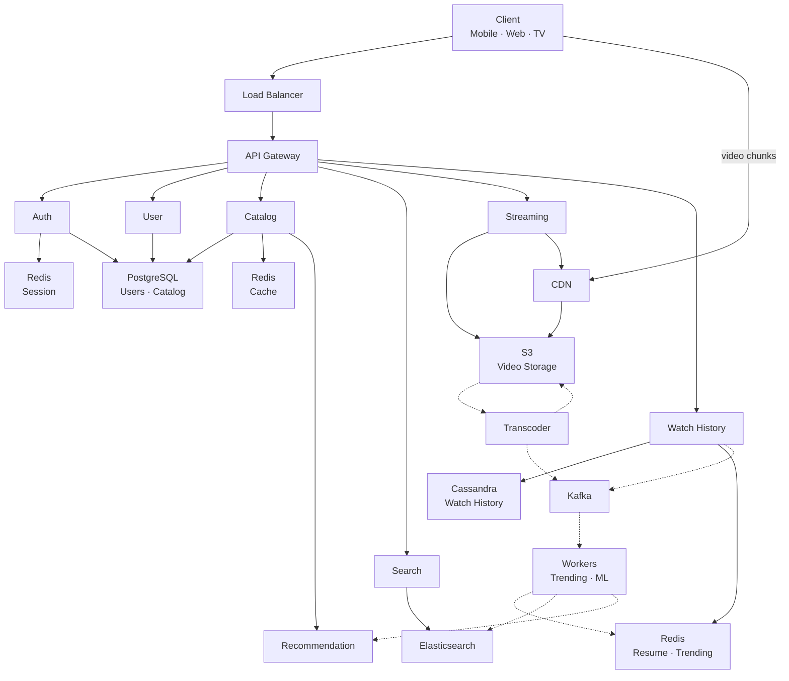

# Netflix Video Streaming — System Design

## 1. Functional Requirements

- User registration, login, profile management
- Browse catalog: M genres, N titles per genre
- Search titles by name, actor, genre
- Stream video with adaptive bitrate (ABR)
- Track watch history and resume position
- Show trending titles per genre and globally
- Personalized recommendations

### Out of Scope

- Payments & subscription billing (separate bounded context)
- Social features (sharing, comments)
- Content upload by creators (admin-only ingestion)
- Offline downloads
- Parental controls

## 2. Non-Functional Requirements

| NFR | Target | Linked FR | Reasoning |
|-----|--------|-----------|-----------|
| Availability | 99.99% | All | Revenue loss at scale ~$1M/min downtime |
| Catalog Latency | < 100ms p99 | Browse, Search | Users abandon after 3s, feed must be instant |
| Stream Start | < 2 seconds | Streaming | Industry benchmark, buffering = churn |
| Write Throughput | 115K writes/sec peak | Watch History | 100M DAU × 20 events/session, must not drop |
| Read Throughput | 18K QPS peak | Catalog Browse | Home feed loaded 3x/day per user |
| Scalability | Horizontal | All | 100M DAU today, design for 500M |
| Consistency — Auth | Strong | Login, Profile | Cannot serve wrong user's data |
| Consistency — Analytics | Eventual | Trending, History | 5s staleness acceptable for view counts |
| Durability | Zero data loss | Watch History, User Data | History is ML training input, cannot lose |
| Fault Tolerance | No SPOF | All | Region failure should not cause global outage |

## 3. Back of Envelope

### Users & Traffic

```
Total Users        = 300M
DAU                = 100M
Concurrent Users   = 10% of DAU = 10M (peak hour)
Avg Sessions/Day   = 2
Avg Session Length  = 45 min
```

### Read / Write QPS

```
--- Watch History Writes ---
Events per session       = 20 (progress update every 30s for 45 min ≈ 90, but batched to ~20)
Total events/day         = 100M users × 20 events = 2B events/day
Avg Write QPS            = 2,000,000,000 / 86,400 = ~23,148 QPS
Peak Write QPS (5x avg)  = 23,148 × 5 = ~115,000 QPS

--- Catalog Reads ---
Feed loads per user/day  = 3
Total reads/day          = 100M × 3 = 300M
Avg Read QPS             = 300,000,000 / 86,400 = ~3,472 QPS
Peak Read QPS (5x avg)   = 3,472 × 5 = ~17,360 QPS

--- Search ---
Searches per user/day    = 5
Total searches/day       = 100M × 5 = 500M
Avg Search QPS           = 500,000,000 / 86,400 = ~5,787 QPS
Peak Search QPS (5x avg) = 5,787 × 5 = ~28,935 QPS
```

### Bandwidth

```
--- Streaming Egress ---
Concurrent streams       = 10M
Avg bitrate              = 5 Mbps (1080p adaptive average)
Total egress             = 10,000,000 × 5 Mbps = 50,000,000 Mbps = 50 Tbps

--- Chunk Serving ---
Chunk duration           = 4 seconds
Chunk size at 5 Mbps     = 5 × 4 / 8 = 2.5 MB per chunk
Chunks served per sec    = 10,000,000 / 4 = 2,500,000 chunks/sec

--- API Bandwidth ---
Avg API response         = 5 KB
Peak API QPS             = 17,360 + 28,935 = ~46,295 QPS
API egress               = 46,295 × 5 KB = ~231 MB/sec = ~1.85 Gbps (negligible vs streaming)
```

### Storage

```
--- Catalog ---
Unique titles            = 50,000
Metadata per title       = 10 KB
Catalog total            = 50,000 × 10 KB = 500 MB (fits entirely in memory)

--- Video Files ---
Avg video length         = 1.5 hours
Resolutions              = 4 (480p, 720p, 1080p, 4K)
Codecs                   = 2 (H.264, H.265)
Audio tracks             = 3
Total variants per title = 4 × 2 × 3 = 24
Avg size per variant     = 3 GB
Storage per title        = 24 × 3 GB = 72 GB
Total video storage      = 50,000 × 72 GB = 3,600,000 GB = 3.6 PB

--- Watch History ---
Record size              = 100 bytes
Records per day          = 2B
Retention                = 1 year
Total history storage    = 2B × 365 × 100 bytes = 73 TB
```

### Cache

```
--- Catalog Cache ---
Working set              = 500 MB full catalog (all fits)
Cache hit ratio          = ~95% (most users browse same popular titles)
Redis memory needed      = 500 MB × 1.5 overhead = ~750 MB

--- Session Cache ---
Concurrent sessions      = 10M
Session size             = 500 bytes
Session cache            = 10M × 500 bytes = 5 GB

--- Trending Cache ---
Sorted sets              = 25 genres + 1 global = 26
Members per set          = 50,000 titles
Per member               = 50 bytes (titleId + score)
Trending cache           = 26 × 50,000 × 50 = 65 MB

Total Redis memory       ≈ 750 MB + 5 GB + 65 MB ≈ ~6 GB
```

### Summary

| Metric | Value |
|--------|-------|
| Concurrent Streams | 10M |
| Streaming Egress | 50 Tbps |
| Chunks/sec | 2.5M |
| Watch History Write QPS | 23K avg / 115K peak |
| Search QPS | 5.8K avg / 29K peak |
| Catalog Read QPS | 3.5K avg / 17K peak |
| Video Storage | 3.6 PB |
| Watch History Storage | 73 TB/year |
| Catalog Size | 500 MB |
| Redis Total | ~6 GB |

## 4. API Design

### Auth

```
POST /auth/signup
  Request:  { email, password, displayName }
  Response: { userId, token }
  Status:   201 Created

POST /auth/login
  Request:  { email, password }
  Response: { token, expiresIn, userId }
  Status:   200 OK

POST /auth/refresh
  Request:  { refreshToken }
  Response: { token, expiresIn }
  Status:   200 OK
```

### User

```
GET /users/{userId}/profile
  Headers:  Authorization: Bearer {token}
  Response: { userId, email, displayName, subscription, preferences: [{genreId, weight}] }
  Status:   200 OK

PUT /users/{userId}/preferences
  Headers:  Authorization: Bearer {token}
  Request:  { preferences: [{genreId, weight}] }
  Response: { updated: true }
  Status:   200 OK
```

### Catalog

```
GET /catalog/home?userId={userId}
  Headers:  Authorization: Bearer {token}
  Response: {
    genres: [
      {
        genreId, genreName,
        titles: [{ titleId, title, rating, thumbnailUrl, contentType }]
      }
    ]
  }
  Status: 200 OK

GET /catalog/genres/{genreId}?page=1&size=20
  Response: {
    genreId, genreName,
    titles: [{ titleId, title, rating, thumbnailUrl, releaseYear }],
    pagination: { page, size, totalPages, totalItems }
  }
  Status: 200 OK

GET /titles/{titleId}
  Response: {
    titleId, title, description, releaseYear, rating, durationSec, contentType,
    genres: [{ genreId, name }],
    episodes: [{ episodeId, seasonNum, episodeNum, title, durationSec }]
  }
  Status: 200 OK
```

### Search

```
GET /search?q={query}&genre={genreId}&year={year}&rating={min}&page=1&size=20
  Response: {
    results: [{ titleId, title, rating, thumbnailUrl, genres, matchScore }],
    pagination: { page, size, totalPages, totalItems }
  }
  Status: 200 OK
```

### Streaming

```
GET /stream/{titleId}/manifest
  Headers:  Authorization: Bearer {token}
  Response: {
    manifestUrl: "https://cdn.netflix.com/{titleId}/master.m3u8",
    drmToken: "...",
    expiresAt: "2026-02-26T12:00:00Z",
    resolutions: ["480p", "720p", "1080p", "4K"]
  }
  Status: 200 OK

GET /cdn/chunks/{titleId}/{resolution}/{chunkId}
  Headers:  Range: bytes=0-1048576
  Response: <binary video chunk>
  Status:   206 Partial Content
```

### Watch History

```
POST /users/{userId}/history
  Headers:  Authorization: Bearer {token}
  Request:  { titleId, episodeId, progressSec, durationSec, timestamp }
  Response: { recorded: true }
  Status:   202 Accepted (async processing)

GET /users/{userId}/history?page=1&size=50
  Response: {
    items: [{ titleId, title, thumbnailUrl, watchedAt, progressSec, durationSec, completed }],
    pagination: { page, size, totalPages }
  }
  Status: 200 OK

GET /users/{userId}/continue-watching
  Response: {
    items: [{ titleId, title, thumbnailUrl, episodeId, progressSec, durationSec, progressPercent }]
  }
  Status: 200 OK
```

### Trending & Recommendations

```
GET /trending?genre={genreId}&window=24h
  Response: {
    window: "24h",
    genre: "action",
    titles: [{ titleId, title, thumbnailUrl, viewCount, rank }]
  }
  Status: 200 OK

GET /recommendations/{userId}
  Headers:  Authorization: Bearer {token}
  Response: {
    forYou: [{ titleId, title, thumbnailUrl, reason, score }],
    becauseYouWatched: [
      { basedOn: "Stranger Things", titles: [{ titleId, title, score }] }
    ]
  }
  Status: 200 OK
```

## 5. Data Modelling & Indexing

### PostgreSQL — Users

```sql
users (
  user_id         UUID PRIMARY KEY,
  email           VARCHAR(255) UNIQUE NOT NULL,
  password_hash   VARCHAR(255) NOT NULL,
  display_name    VARCHAR(100),
  subscription    VARCHAR(20) DEFAULT 'FREE',
  created_at      TIMESTAMP DEFAULT NOW(),
  updated_at      TIMESTAMP DEFAULT NOW()
)

user_preferences (
  user_id    UUID REFERENCES users(user_id),
  genre_id   UUID REFERENCES genres(genre_id),
  weight     FLOAT DEFAULT 1.0,
  PRIMARY KEY (user_id, genre_id)
)

-- Indexes
CREATE INDEX idx_users_email ON users(email);            -- login lookup
CREATE INDEX idx_user_prefs_user ON user_preferences(user_id);  -- fetch all prefs for a user
```

### PostgreSQL — Catalog

```sql
genres (
  genre_id       UUID PRIMARY KEY,
  name           VARCHAR(100) UNIQUE NOT NULL,
  display_order  INT
)

titles (
  title_id       UUID PRIMARY KEY,
  title          VARCHAR(500) NOT NULL,
  description    TEXT,
  release_year   INT,
  rating         DECIMAL(3,1),
  duration_sec   INT,
  content_type   VARCHAR(20),
  thumbnail_url  VARCHAR(1000),
  manifest_key   VARCHAR(500),
  created_at     TIMESTAMP DEFAULT NOW(),
  updated_at     TIMESTAMP DEFAULT NOW()
)

title_genres (
  title_id  UUID REFERENCES titles(title_id),
  genre_id  UUID REFERENCES genres(genre_id),
  PRIMARY KEY (title_id, genre_id)
)

episodes (
  episode_id     UUID PRIMARY KEY,
  title_id       UUID REFERENCES titles(title_id),
  season_num     INT,
  episode_num    INT,
  episode_title  VARCHAR(500),
  duration_sec   INT,
  manifest_key   VARCHAR(500),
  UNIQUE (title_id, season_num, episode_num)
)

-- Indexes
CREATE INDEX idx_title_genres_genre ON title_genres(genre_id);                      -- browse by genre
CREATE INDEX idx_titles_release ON titles(release_year DESC);                       -- sort by newest
CREATE INDEX idx_titles_rating ON titles(rating DESC);                              -- sort by top rated
CREATE INDEX idx_episodes_title ON episodes(title_id, season_num, episode_num);     -- episode listing
```

### Cassandra — Watch History

```sql
-- All history for a user, latest first
CREATE TABLE watch_history (
  user_id       UUID,
  watched_at    TIMESTAMP,
  title_id      UUID,
  episode_id    UUID,
  progress_sec  INT,
  duration_sec  INT,
  completed     BOOLEAN,
  PRIMARY KEY (user_id, watched_at)
) WITH CLUSTERING ORDER BY (watched_at DESC)
  AND default_time_to_live = 31536000;    -- 1 year TTL

-- Resume position per title (latest progress)
CREATE TABLE watch_progress (
  user_id       UUID,
  title_id      UUID,
  episode_id    UUID,
  progress_sec  INT,
  duration_sec  INT,
  updated_at    TIMESTAMP,
  PRIMARY KEY (user_id, title_id)
);
```

### Redis Key Patterns

```
session:{sessionId}            → JSON {userId, roles}              TTL 1h
home_feed:{userId}             → JSON {serialized feed}            TTL 5m
manifest:{titleId}             → JSON {manifest data}              TTL 5m
resume:{userId}                → HASH {titleId → progressSec}      TTL 7d
trending:global:24h            → SORTED SET {titleId → score}      TTL 24h
trending:{genreId}:24h         → SORTED SET {titleId → score}      TTL 24h
recs:{userId}                  → JSON {recommendation results}     TTL 1h
```

### Elasticsearch Index

```json
{
  "index": "titles",
  "mappings": {
    "properties": {
      "title_id":     { "type": "keyword" },
      "title":        { "type": "text", "analyzer": "standard", "search_analyzer": "standard" },
      "description":  { "type": "text", "analyzer": "standard" },
      "genres":       { "type": "keyword" },
      "actors":       { "type": "text", "fields": { "raw": { "type": "keyword" } } },
      "directors":    { "type": "text" },
      "release_year": { "type": "integer" },
      "rating":       { "type": "float" },
      "tags":         { "type": "keyword" },
      "popularity":   { "type": "float" }
    }
  }
}
```

## 6. Sharding & Partitioning

| Component | Strategy | Shard / Partition Key | Why | Hot Partition Risk | Mitigation |
|-----------|----------|----------------------|-----|-------------------|------------|
| Users DB (PG) | Hash shard | user_id | Even distribution, all queries by user_id | Low — UUIDs distribute evenly | None needed |
| Catalog DB (PG) | No shard, read replicas | — | 500 MB fits in memory | None — small dataset | Add replicas for read scale |
| Cassandra | Consistent hash ring | user_id (partition key) | Co-locates all user history on same node | Power users with huge history | Composite key (user_id, month_bucket) |
| Redis Cluster | Hash slots | Key prefix | Auto-distributed across 16384 slots | Trending sorted sets (hot keys) | Replicate trending keys to all read replicas |
| Elasticsearch | Index sharding + routing | genre (routing key) | Genre-scoped search hits single shard | Popular genre searches | Increase shard count for hot genres |
| Kafka | Range partition | user_id | Ordering per user, parallel consumers | Viral content spikes | Increase partition count, monitor consumer lag |
| S3 | Prefix-based | {titleId}/{resolution}/ | S3 auto-partitions by prefix | New release = hot prefix | Random prefix hash or CDN absorbs |

## 7. HLD



## 8. HLD Walkthrough

### Step 1 — User Opens App

- Client hits Load Balancer → API Gateway
- `POST /auth/login` → Auth Service
- Auth checks Redis session cache → on miss, verifies creds in PostgreSQL
- Returns JWT token

### Step 2 — Home Feed Loads

- `GET /catalog/home?userId={id}` → Catalog Service
- Check Redis feed cache (TTL 5 min) → on hit, return immediately
- On miss: call Recommendation Service for ranking weights + query PostgreSQL for titles per genre
- Assemble personalized feed, cache in Redis, return

### Step 3 — User Searches

- `GET /search?q=stranger` → Search Service
- Query Elasticsearch with full-text + filters
- Return ranked results with fuzzy matching

### Step 4 — User Clicks Play

- `GET /stream/{titleId}/manifest` → Streaming Service
- Check Redis for cached manifest → on miss, fetch from S3
- Inject signed CDN URLs + DRM tokens into manifest
- Return HLS `.m3u8` to client
- Client fetches chunks directly from CDN: `GET /cdn/chunks/{id}/{res}/{chunk}`
- CDN serves from edge cache → on miss, pulls from S3 origin

### Step 5 — Progress Tracking (Every 30s)

- `POST /history` → Watch History Service
- Write resume position to Redis (fast read for continue-watching)
- Persist full history to Cassandra (durable, CL=QUORUM)
- Publish `view-event` to Kafka (async, fire-and-forget)

### Step 6 — Trending Computation (Async)

- Background Workers consume `view-events` from Kafka
- `ZINCRBY trending:global:24h 1 {titleId}` in Redis
- When user requests `GET /trending` → `ZREVRANGE` returns pre-computed top-K

### Step 7 — Content Ingestion (Async)

- New video uploaded to S3
- Transcoding Workers encode into multiple resolutions + codecs
- Store encoded chunks back in S3
- Publish `content-ready` to Kafka
- Workers update Elasticsearch index + notify Recommendation Service

## 9. Trade-offs

| Decision | Chose | Over | Why |
|----------|-------|------|-----|
| Watch History DB | Cassandra | PostgreSQL | 115K peak writes/sec, linear write scalability |
| Search | Elasticsearch | DB LIKE query | Fuzzy, ranked, faceted search at 30K QPS |
| Trending | Redis ZINCRBY | DB aggregation | O(log N) increment, instant top-K reads |
| Video Delivery | CDN + S3 | Direct from origin | 50 Tbps at edge, sub-100ms latency globally |
| Catalog Cache | Redis TTL 5m | No cache | 95% cache hit ratio, offloads PostgreSQL |
| Consistency | Eventual for analytics | Strong everywhere | Throughput over precision for trending/history |
| Event Bus | Kafka | RabbitMQ | Replay capability, ordering, massive throughput |
| Feed Strategy | Pull + cache (fan-out on read) | Pre-compute (fan-out on write) | 50K titles × 100M users impossible to pre-compute |
| Catalog Sharding | Read replicas, no shard | Hash shard | 500 MB catalog fits in memory, no shard complexity |
| ABR Protocol | HLS | DASH | Universal device support including Apple ecosystem |

## 10. Fault Tolerance

| What Fails | Impact | Mitigation |
|------------|--------|------------|
| Auth Service down | No new logins | Existing JWTs still valid (stateless), circuit breaker, multiple instances |
| PostgreSQL primary down | No catalog writes | Auto-failover to streaming replica < 30s, reads continue from replicas |
| Redis down | Cache miss spike | Circuit breaker → fallback to DB, auto-scale DB read replicas |
| Cassandra node down | Reduced write capacity | RF=3, CL=QUORUM → 2 of 3 replicas still serve reads/writes |
| Kafka broker down | Event loss risk | Replication factor 3, min.insync.replicas=2, producer acks=all |
| CDN edge down | Streaming disruption | Multi-CDN (CloudFront + Akamai), DNS failover |
| Elasticsearch down | Search unavailable | Fallback to basic PostgreSQL LIKE query (degraded but functional) |
| Recommendation Service down | No personalized feed | Fallback to trending/popular titles from Redis cache |
| Full region down | Regional outage | Active-active multi-region, GeoDNS reroutes to nearest healthy region |
