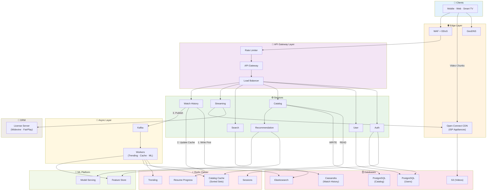

# Netflix Video Streaming — System Design

## 1. Functional Requirements

- User registration, login, profile management (multi-profile per account)
- Browse catalog: M genres, N titles per genre
- Search titles by name, actor, genre, director
- Stream video with adaptive bitrate (ABR)
- Track watch history and resume position
- Show trending titles per genre and globally
- Personalized recommendations
- A/B testing for UI and algorithm experiments

### Out of Scope

- Payments & subscription billing (separate bounded context)
- Social features (sharing, comments)
- Content upload by creators (admin-only ingestion)
- Offline downloads
- Parental controls
- Live streaming (sports, events)

---

## 2. Non-Functional Requirements

| NFR | Target | Linked FR | Reasoning |
|-----|--------|-----------|-----------|
| Availability | 99.99% | All | Revenue loss at scale ~$1M/min downtime |
| Catalog Latency | < 100ms p99 | Browse, Search | Users abandon after 3s, feed must be instant |
| Stream Start | < 2 seconds | Streaming | Industry benchmark, buffering = churn |
| Write Throughput | 115K writes/sec peak | Watch History | 100M DAU × 20 events/session, must not drop |
| Read Throughput | 18K QPS peak | Catalog Browse | Home feed loaded 3x/day per user |
| Scalability | Horizontal | All | 100M DAU today, design for 500M |
| Consistency — Auth | Strong | Login, Profile | Cannot serve wrong user's data |
| Consistency — Analytics | Eventual (≤5s) | Trending, History | 5s staleness acceptable for view counts |
| Durability | Zero data loss | Watch History, User Data | History is ML training input, cannot lose |
| Fault Tolerance | No SPOF | All | Region failure should not cause global outage |
| Security | DRM protected | Streaming | Content protection required by studios |
| Global Latency | < 50ms to edge | Streaming | CDN edge must be close to users |

---

## 3. Back of Envelope

### Users & Traffic

```
Total Users        = 300M
DAU                = 100M
Concurrent Users   = 10% of DAU = 10M (peak hour)
Avg Sessions/Day   = 2
Avg Session Length = 45 min
Regions            = 5 (NA, EU, APAC, LATAM, MEA)
```

### Read / Write QPS

```
--- Watch History Writes ---
Events per session       = 20 (progress update every 30s for 45 min ≈ 90, but batched to ~20)
Total events/day         = 100M users × 20 events = 2B events/day
Avg Write QPS            = 2,000,000,000 / 86,400 = ~23,148 QPS
Peak Write QPS (5x avg)  = 23,148 × 5 = ~115,000 QPS

--- Catalog Reads ---
Feed loads per user/day  = 3
Total reads/day          = 100M × 3 = 300M
Avg Read QPS             = 300,000,000 / 86,400 = ~3,472 QPS
Peak Read QPS (5x avg)   = 3,472 × 5 = ~17,360 QPS

--- Search ---
Searches per user/day    = 5
Total searches/day       = 100M × 5 = 500M
Avg Search QPS           = 500,000,000 / 86,400 = ~5,787 QPS
Peak Search QPS (5x avg) = 5,787 × 5 = ~28,935 QPS

--- API Gateway ---
Total Peak QPS           = 115K + 17K + 29K + misc = ~200K QPS
```

### Bandwidth

```
--- Streaming Egress ---
Concurrent streams       = 10M
Avg bitrate              = 5 Mbps (1080p adaptive average)
Total egress             = 10,000,000 × 5 Mbps = 50,000,000 Mbps = 50 Tbps

--- Chunk Serving ---
Chunk duration           = 4 seconds
Chunk size at 5 Mbps     = 5 × 4 / 8 = 2.5 MB per chunk
Chunks served per sec    = 10,000,000 / 4 = 2,500,000 chunks/sec

--- API Bandwidth ---
Avg API response         = 5 KB
Peak API QPS             = 200K QPS
API egress               = 200,000 × 5 KB = ~1 GB/sec = ~8 Gbps (negligible vs streaming)
```

### Storage

```
--- Catalog ---
Unique titles            = 50,000
Metadata per title       = 10 KB
Catalog total            = 50,000 × 10 KB = 500 MB (fits entirely in memory)

--- Video Files ---
Avg video length         = 1.5 hours
Resolutions              = 4 (480p, 720p, 1080p, 4K)
Codecs                   = 2 (H.264, H.265/HEVC)
Audio tracks             = 3 (stereo, 5.1, Atmos)
Total variants per title = 4 × 2 × 3 = 24
Avg size per variant     = 3 GB
Storage per title        = 24 × 3 GB = 72 GB
Total video storage      = 50,000 × 72 GB = 3,600,000 GB = 3.6 PB

--- Watch History ---
Record size              = 100 bytes
Records per day          = 2B
Retention                = 2 years (ML training requires long history)
Total history storage    = 2B × 730 × 100 bytes = 146 TB

--- User Data ---
Users                    = 300M
User record size         = 2 KB (profile, preferences, settings)
User storage             = 300M × 2 KB = 600 GB
```

### Cache Sizing

```
--- Catalog Cache ---
Working set              = 500 MB full catalog
Cache overhead           = 1.5x
Catalog cache            = 500 MB × 1.5 = 750 MB

--- Session Cache ---
Concurrent sessions      = 10M
Session size             = 500 bytes
Session cache            = 10M × 500 bytes = 5 GB

--- Trending Cache ---
Sorted sets              = 25 genres + 1 global = 26
Members per set          = 50,000 titles
Per member               = 50 bytes (titleId + score)
Trending cache           = 26 × 50,000 × 50 = 65 MB

--- Home Feed Cache ---
Concurrent users         = 10M
Feed cache hit rate      = 30% (rest served from sorted sets)
Cached feeds             = 3M feeds
Avg feed size            = 50 KB (25 genres × 20 titles × 100 bytes)
Home feed cache          = 3M × 50 KB = 150 GB

--- Resume Position Cache ---
Active users with resume = 50M
Positions per user       = 5 titles avg
Entry size               = 100 bytes
Resume cache             = 50M × 5 × 100 = 25 GB

--- Manifest Cache ---
Popular titles           = 5,000 (10% of catalog)
Manifest size            = 10 KB
Manifest cache           = 5,000 × 10 KB = 50 MB

Total Redis Memory       ≈ 750 MB + 5 GB + 65 MB + 150 GB + 25 GB + 50 MB ≈ 181 GB
```

### Summary

| Metric | Value |
|--------|-------|
| Concurrent Streams | 10M |
| Streaming Egress | 50 Tbps |
| Chunks/sec | 2.5M |
| Watch History Write QPS | 23K avg / 115K peak |
| Search QPS | 5.8K avg / 29K peak |
| Catalog Read QPS | 3.5K avg / 17K peak |
| API Gateway QPS | ~200K peak |
| Video Storage | 3.6 PB |
| Watch History Storage | 146 TB (2 years) |
| Catalog Size | 500 MB |
| Redis Cluster Total | ~181 GB |

---

## 4. API Design

### Versioning & Common Headers

```
Base URL: https://api.netflix.com/v1

Common Headers:
  Authorization: Bearer {token}
  X-Request-ID: {uuid}
  X-Device-Type: {mobile|web|tv}
  X-Experiment-IDs: {id1,id2}
```

### Auth

```
POST /v1/auth/signup
  Request:  { email, password, displayName }
  Response: { userId, accessToken, refreshToken, expiresIn }
  Status:   201 Created

POST /v1/auth/login
  Request:  { email, password, deviceId }
  Response: { accessToken, refreshToken, expiresIn, userId, profiles: [...] }
  Status:   200 OK

POST /v1/auth/refresh
  Request:  { refreshToken }
  Response: { accessToken, expiresIn }
  Status:   200 OK
```

### User & Profiles

```
GET /v1/users/{userId}/profiles
  Response: { profiles: [{ profileId, name, avatar, isKids, preferences }] }
  Status:   200 OK

PUT /v1/profiles/{profileId}/preferences
  Request:  { genres: [{genreId, weight}], maturityRating, audioLanguage }
  Response: { updated: true }
  Status:   200 OK
```

### Catalog

```
GET /v1/catalog/home?profileId={profileId}
  Response: {
    rows: [
      { rowId, rowType, title, titles: [{ titleId, title, thumbnailUrl, matchScore }] }
    ],
    experimentId: "home_layout_v3"
  }
  Status: 200 OK

GET /v1/catalog/genres/{genreId}?page=1&size=20&sort=popular
  Response: {
    genreId, genreName,
    titles: [{ titleId, title, rating, thumbnailUrl, releaseYear }],
    pagination: { page, size, totalPages, nextCursor }
  }
  Status: 200 OK

GET /v1/titles/{titleId}
  Response: {
    titleId, title, description, releaseYear, rating, durationSec,
    genres: [{ genreId, name }],
    cast: [{ personId, name, role }],
    episodes: [{ episodeId, seasonNum, episodeNum, title, durationSec }],
    similar: [{ titleId, title, matchScore }]
  }
  Status: 200 OK
```

### Search

```
GET /v1/search?q={query}&genre={genreId}&page=1&size=20
  Response: {
    results: [{ titleId, title, thumbnailUrl, matchScore, highlightedTitle }],
    suggestions: ["stranger things", "stranger"],
    pagination: { page, size, totalPages }
  }
  Status: 200 OK
```

### Streaming

```
GET /v1/stream/{titleId}/manifest?profileId={profileId}&episodeId={episodeId}
  Response: {
    playbackId: "uuid",
    manifestUrl: "https://oc.netflix.com/{signed-path}/master.m3u8",
    drmConfig: {
      widevine: { licenseUrl, certificateUrl },
      fairplay: { licenseUrl, certificateUrl },
      playready: { licenseUrl }
    },
    resumePositionSec: 1234,
    expiresAt: "2026-02-26T12:00:00Z"
  }
  Status: 200 OK

POST /v1/stream/{playbackId}/heartbeat
  Request:  { currentPositionSec, bitrateKbps, bufferHealthSec }
  Response: { continue: true }
  Status:   200 OK
```

### Watch History

```
POST /v1/profiles/{profileId}/history
  Request:  { titleId, episodeId?, progressSec, durationSec, timestamp }
  Response: { recorded: true }
  Status:   202 Accepted

GET /v1/profiles/{profileId}/continue-watching
  Response: {
    items: [{ titleId, title, thumbnailUrl, progressSec, durationSec, progressPercent }]
  }
  Status: 200 OK
```

### Trending & Recommendations

```
GET /v1/trending?genre={genreId}&window=24h&region={region}
  Response: {
    titles: [{ titleId, title, thumbnailUrl, viewCount, rank }]
  }
  Status: 200 OK

GET /v1/profiles/{profileId}/recommendations
  Response: {
    forYou: [{ titleId, title, thumbnailUrl, reason, score }],
    becauseYouWatched: [{ basedOn: { titleId, title }, titles: [...] }]
  }
  Status: 200 OK
```

---

## 5. Data Modeling & Indexing

### PostgreSQL — Users & Profiles (Sharded by user_id)

```sql
users (
  user_id         UUID PRIMARY KEY,
  email           VARCHAR(255) UNIQUE NOT NULL,
  password_hash   VARCHAR(255) NOT NULL,
  region          VARCHAR(10) NOT NULL,
  created_at      TIMESTAMP DEFAULT NOW()
)

profiles (
  profile_id      UUID PRIMARY KEY,
  user_id         UUID NOT NULL,
  name            VARCHAR(100) NOT NULL,
  avatar_url      VARCHAR(500),
  is_kids         BOOLEAN DEFAULT FALSE,
  maturity_rating VARCHAR(10) DEFAULT 'TV-MA'
)

profile_preferences (
  profile_id    UUID REFERENCES profiles(profile_id),
  genre_id      UUID,
  weight        FLOAT DEFAULT 1.0,
  PRIMARY KEY (profile_id, genre_id)
)

-- Indexes
CREATE INDEX idx_users_email ON users(email);
CREATE INDEX idx_profiles_user ON profiles(user_id);
```

### PostgreSQL — Catalog (Read Replicas, No Sharding)

```sql
genres (
  genre_id       UUID PRIMARY KEY,
  name           VARCHAR(100) UNIQUE NOT NULL,
  display_order  INT
)

titles (
  title_id       UUID PRIMARY KEY,
  title          VARCHAR(500) NOT NULL,
  description    TEXT,
  release_year   INT,
  rating         DECIMAL(3,1),
  duration_sec   INT,
  content_type   VARCHAR(20),
  maturity_rating VARCHAR(10),
  thumbnail_url  VARCHAR(1000),
  popularity_score FLOAT DEFAULT 0
)

title_genres (
  title_id  UUID REFERENCES titles(title_id),
  genre_id  UUID REFERENCES genres(genre_id),
  PRIMARY KEY (title_id, genre_id)
)

episodes (
  episode_id     UUID PRIMARY KEY,
  title_id       UUID REFERENCES titles(title_id),
  season_num     INT,
  episode_num    INT,
  episode_title  VARCHAR(500),
  duration_sec   INT,
  UNIQUE (title_id, season_num, episode_num)
)

-- Indexes
CREATE INDEX idx_title_genres_genre ON title_genres(genre_id);
CREATE INDEX idx_titles_popularity ON titles(popularity_score DESC);
CREATE INDEX idx_episodes_title ON episodes(title_id, season_num, episode_num);
```

### Cassandra — Watch History

```sql
-- Partition: (profile_id, year_month) to prevent hot partitions
CREATE TABLE watch_history (
  profile_id    UUID,
  year_month    TEXT,
  watched_at    TIMESTAMP,
  title_id      UUID,
  episode_id    UUID,
  progress_sec  INT,
  duration_sec  INT,
  completed     BOOLEAN,
  PRIMARY KEY ((profile_id, year_month), watched_at)
) WITH CLUSTERING ORDER BY (watched_at DESC)
  AND default_time_to_live = 63072000;

-- Resume position per title
CREATE TABLE watch_progress (
  profile_id    UUID,
  title_id      UUID,
  episode_id    UUID,
  progress_sec  INT,
  duration_sec  INT,
  updated_at    TIMESTAMP,
  PRIMARY KEY (profile_id, title_id)
);
```

### Redis Key Patterns

```
=== Session & Auth ===
session:{sessionId}              → JSON {userId, profileId, roles}     TTL 1h
refresh:{refreshToken}           → JSON {userId, deviceId}             TTL 30d

=== Catalog Read Path (CQRS) ===
catalog:genre:{genreId}          → SORTED SET {titleId → score}        No TTL
title:meta:{titleId}             → HASH {title, rating, thumbnailUrl}
home_feed:{profileId}            → JSON {serialized feed}              TTL 5m

=== Watch Progress ===
resume:{profileId}               → HASH {titleId → progressJson}       TTL 30d
continue:{profileId}             → LIST [titleId1, titleId2, ...]      TTL 7d

=== Streaming ===
manifest:{titleId}               → JSON {signed URLs, DRM config}      TTL 5m
playback:{playbackId}            → HASH {profileId, titleId, status}   TTL 4h

=== Trending ===
trending:global:24h              → SORTED SET {titleId → viewCount}    TTL 25h
trending:{genreId}:24h           → SORTED SET {titleId → viewCount}    TTL 25h

=== Rate Limiting ===
ratelimit:{endpoint}:{id}        → COUNT                               TTL varies
```

### Elasticsearch Index

```json
{
  "index": "titles",
  "settings": {
    "number_of_shards": 10,
    "number_of_replicas": 2
  },
  "mappings": {
    "properties": {
      "title_id":     { "type": "keyword" },
      "title":        { "type": "text", "analyzer": "standard" },
      "description":  { "type": "text" },
      "genres":       { "type": "keyword" },
      "actors":       { "type": "text" },
      "release_year": { "type": "integer" },
      "rating":       { "type": "float" },
      "popularity":   { "type": "float" },
      "suggest":      { "type": "completion" }
    }
  }
}
```

---

## 6. Sharding & Partitioning Strategy

| Component | Strategy | Key | Rationale | Hot Spot Mitigation |
|-----------|----------|-----|-----------|---------------------|
| Users DB (PG) | Hash shard | user_id | Even distribution | UUIDs distribute evenly |
| Catalog DB (PG) | No shard | — | 500 MB fits in memory | 10+ read replicas |
| Cassandra History | Composite partition | (profile_id, year_month) | Bounds partition size | Monthly bucket limits |
| Redis Cluster | Hash slots | Key prefix | Auto-distributed | Replicas for hot keys |
| Elasticsearch | Default sharding | — | Cross-genre searches | Query caching |
| Kafka | Topic-based | Varies | Different patterns | See below |
| S3 / CDN | Prefix-based | {hash}/{titleId}/ | Auto-partitions | Random prefix hash |

### Kafka Topics

| Topic | Partitions | Key | Use Case |
|-------|------------|-----|----------|
| watch-events | 256 | profileId | History writes, Analytics |
| catalog-updates | 16 | titleId | Cache invalidation |
| trending-aggregation | 64 | titleId | Trending computation |
| recommendation-events | 128 | profileId | ML feature updates |

---

## 7. High-Level Design (HLD)



---

## 8. HLD Walkthrough

### Step 1 — User Login

1. Client → GeoDNS → nearest region
2. `POST /v1/auth/login` → Auth Service
3. Rate limit check in Redis
4. Verify credentials in PostgreSQL
5. Create session in Redis, return JWT

### Step 2 — Home Feed (CQRS Read Path)

**Key: Read path NEVER touches PostgreSQL**

1. `GET /v1/catalog/home` → Catalog Service
2. **L1 Cache:** `GET home_feed:{profileId}` (TTL 5m)
   - HIT → Return (~1ms)
   - MISS → Continue
3. **L2 — Redis Sorted Sets:**
   ```
   ZREVRANGE catalog:genre:{genreId} 0 19  (× 25 genres)
   HGETALL title:meta:{titleId}            (× 500 titles)
   ```
4. Call Recommendation Service for personalization
5. Cache result, return feed

### Step 3 — Search

1. `GET /v1/search?q=stranger` → Search Service
2. Query Elasticsearch with fuzzy matching
3. Return ranked results

### Step 4 — Play Video

**4a. Manifest Request:**
1. `GET /v1/stream/{titleId}/manifest` → Streaming Service
2. Check Redis cache for manifest
3. If miss: build manifest, sign CDN URLs, get DRM tokens
4. Cache in Redis (TTL 5m)
5. Return manifest + resume position

**4b. Video Playback:**
1. Client requests DRM license
2. License Server validates session, returns keys
3. Client fetches chunks from Open Connect CDN
4. ABR switches quality based on bandwidth

### Step 5 — Progress Tracking

Every 30 seconds:

1. `POST /v1/profiles/{profileId}/history` → Watch History Service
2. **Write to Cassandra FIRST** (source of truth, CL=LOCAL_QUORUM)
3. **Update Redis** (best effort cache)
4. **Publish to Kafka** (fire-and-forget for analytics)
5. Return `202 Accepted`

### Step 6 — Trending (Async)

1. Workers consume from Kafka
2. `ZINCRBY trending:global:24h 1 {titleId}`
3. User requests → `ZREVRANGE` returns top-K

### Step 7 — Catalog Update (CQRS Write Path)

1. Admin updates title → Catalog Service → PostgreSQL
2. Publish `catalog-updated` to Kafka
3. Workers rebuild Redis sorted sets + Elasticsearch

---

## 9. Key Component Deep Dives

### 9.1 Open Connect CDN

Netflix's custom CDN with appliances inside ISPs:

- **OCA (Open Connect Appliance):** 100TB+ storage, placed in ISP data centers
- **Proactive Fill:** Popular content pushed overnight before users request
- **Steering Service:** Routes users to optimal OCA based on health, load, location
- **95%+ cache hit rate** at ISP level
- **Sub-10ms latency** (same ISP network)

### 9.2 Watch Progress Consistency

```
Write Order:
1. Cassandra (QUORUM) ─── Source of truth, durable
       ↓
2. Redis (best effort) ── Fast reads, can rebuild from Cassandra
       ↓
3. Kafka (fire-forget) ── Analytics, can tolerate gaps
```

If Redis fails → client still gets `202`, background job reconciles from Cassandra.

### 9.3 Recommendation System

**Offline Pipeline:**
```
Kafka (watch events) → Spark → Model Training → Model Registry
                         ↓
                    Feature Store
```

**Online Serving:**
```
Request → Feature Retrieval → Model Inference → Re-ranking → Response
              ↓                    ↓
         Feature Store      Collaborative Filter
                            + Content-Based NN
                            + Sequence Model
```

### 9.4 DRM Architecture

| Device | DRM System | Max Quality |
|--------|------------|-------------|
| Android, Chrome | Widevine | L1: 4K, L3: 720p |
| iOS, Safari | FairPlay | 4K |
| Windows, Xbox | PlayReady | 4K |

License Server validates: session token, device trust level, subscription tier.

### 9.5 Multi-Region Architecture

```
                    GeoDNS
                      │
        ┌─────────────┼─────────────┐
        ▼             ▼             ▼
    US-EAST       EU-WEST        APAC
    (Primary)     (Replica)    (Replica)
        │             │             │
        └──── Async Replication ────┘
```

| Data Type | Consistency | Strategy |
|-----------|-------------|----------|
| User Auth | Strong | Single home region |
| Catalog | Eventual (1s) | Primary in US-EAST |
| Watch History | Eventual (5s) | Cassandra multi-DC |
| Session | Regional | No cross-region repl |
| Trending | Regional | Computed per region |

---

## 10. Trade-offs

| Decision | Chose | Over | Why |
|----------|-------|------|-----|
| CDN | Open Connect | CloudFront/Akamai | Cost control at 50 Tbps, ISP placement |
| History DB | Cassandra | PostgreSQL | 115K writes/sec, multi-DC |
| Search | Elasticsearch | PostgreSQL LIKE | Fuzzy, faceted, 30K QPS |
| Trending | Redis ZINCRBY | DB aggregation | O(log N), instant top-K |
| Catalog Reads | Redis CQRS | Direct PostgreSQL | 1ms vs 200ms |
| Consistency | Eventual (analytics) | Strong | Throughput > precision |
| Event Bus | Kafka | RabbitMQ | Replay, ordering, throughput |
| Feed | Pull + cache | Pre-compute | 50K titles × 100M users impossible |
| Multi-region | Active-Active | Active-Passive | Global low latency |
| Progress Sync | Cassandra-first | Redis-first | Durability > latency |
| ABR Protocol | HLS | DASH | Apple ecosystem support |

---

## 11. Fault Tolerance

| Component | Failure Impact | Mitigation | RTO |
|-----------|---------------|------------|-----|
| Auth Service | No new logins | JWTs still valid, circuit breaker | 30s |
| PostgreSQL Primary | No writes | Auto-failover to replica | 30s |
| Redis Node | Cache miss spike | Redis Cluster failover | 10s |
| Cassandra Node | Reduced capacity | RF=3, LOCAL_QUORUM | 0s |
| Kafka Broker | Event delay | RF=3, producer retries | 5s |
| Open Connect OCA | Stream interrupt | Steering redirects | 2s |
| Recommendation | Generic feed | Fallback to trending | 0s |
| Full Region | Regional outage | GeoDNS failover | 2 min |

### Graceful Degradation

```
Level 0: Full personalization + recommendations
Level 1: Personal history + trending (Rec down)
Level 2: Database fallback (Redis down)
Level 3: Route to alternate region
Level 4: Static emergency page
```

---

## 12. Observability

### Key Metrics

```yaml
Latency:
  - http_request_duration_seconds{service, endpoint}
  - cassandra_query_latency_seconds
  - redis_command_duration_seconds

Throughput:
  - http_requests_total
  - kafka_messages_produced_total
  - kafka_consumer_lag

Errors:
  - http_errors_total
  - circuit_breaker_state

Business:
  - active_streams_total{region, quality}
  - playback_starts_total
```

### Alerting

```yaml
- HighLatencyP99: p99 > 500ms for 5m → Warning
- ErrorRateSpike: error_rate > 1% for 2m → Critical
- KafkaConsumerLag: lag > 100K for 10m → Warning
- StreamingEgressDrop: egress < 40 Tbps for 5m → Critical
```

---

## 13. Security

| Layer | Protection |
|-------|------------|
| Edge | WAF, DDoS (CloudFlare), TLS 1.3 |
| API Gateway | JWT validation, Rate limiting |
| Service Mesh | mTLS, Service-to-service auth |
| Data | Encryption at rest (AES-256), Field-level for PII |
| Content | Multi-DRM, Hardware security, Forensic watermarking |

### Rate Limits

```yaml
/auth/login:     5/min per email
/auth/signup:    3/min per IP
/stream/manifest: 30/min per user
Global:          200K QPS
```

---

## 14. Cost Estimation (100M DAU)

| Component | Monthly Cost |
|-----------|-------------|
| CDN / Open Connect | $15M |
| Compute (Services) | $8M |
| Storage (S3) | $3M |
| Databases | $4M |
| Transcoding | $2M |
| Search | $1M |
| Kafka + Other | $2M |
| **Total** | **~$35M/month** |
| **Per User** | **~$0.35/month** |

---

## 15. Summary

| Metric | Target | How Achieved |
|--------|--------|--------------|
| 50 Tbps egress | ✓ | Open Connect CDN in ISPs |
| 115K writes/sec | ✓ | Cassandra with LOCAL_QUORUM |
| 200K API QPS | ✓ | Regional API gateways |
| < 100ms p99 catalog | ✓ | CQRS with Redis sorted sets |
| < 2s stream start | ✓ | Manifest caching + CDN |
| 99.99% availability | ✓ | Multi-region active-active |
| DRM protection | ✓ | Widevine + FairPlay + PlayReady |

**Key Patterns:**
1. **CQRS** — Redis for reads, PostgreSQL for writes
2. **Event Sourcing** — Kafka for analytics and ML
3. **Circuit Breaker** — Graceful degradation
4. **Multi-region Active-Active** — Global low latency
5. **Edge Computing** — Open Connect in ISPs
