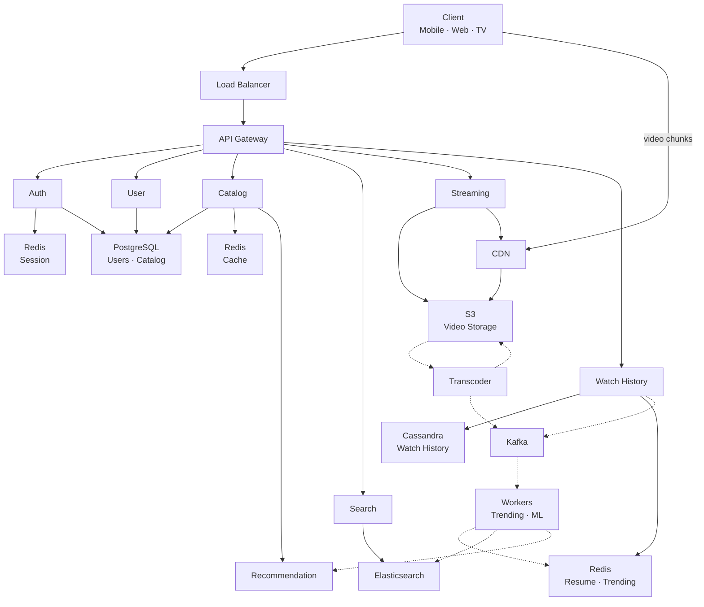

# Netflix Video Streaming — System Design

## 1. Functional Requirements

- User registration, login, profile management
- Browse catalog: M genres, N titles per genre
- Search titles by name, actor, genre
- Stream video with adaptive bitrate (ABR)
- Track watch history and resume position
- Show trending titles per genre and globally
- Personalized recommendations

## 2. Non-Functional Requirements

- 99.99% availability
- Catalog/Search latency < 100ms p99
- Stream start < 2 seconds
- Support 100M DAU, 10M concurrent streams
- Horizontal scalability
- Eventual consistency for analytics, strong for auth

## 3. Back of Envelope

```
DAU                = 100M
Concurrent Streams = 10M
Avg Bitrate        = 5 Mbps
Egress Bandwidth   = 10M × 5 Mbps = 50 Tbps
Chunk Size         = ~1.25 MB (4 sec at 5 Mbps)
Chunks/sec         = 10M / 4 = 2.5M chunks/sec

Genres             = 25
Titles/Genre       = 10,000
Unique Titles      = ~50,000
Catalog Size       = 50K × 10 KB = 500 MB (fits in memory)

Video Storage      = 50K × 24 variants × 3 GB = ~3.6 PB

Watch History QPS  = 100M × 20 events / 86400 = ~23K avg, ~115K peak
Search QPS         = ~6K avg, ~30K peak
Catalog Read QPS   = ~3.5K avg, ~18K peak
```

## 4. API Design

```
POST   /auth/login
GET    /users/{id}/profile

GET    /catalog/home?userId={id}
GET    /catalog/genres/{genreId}?page=1&size=20
GET    /titles/{titleId}

GET    /search?q={query}&genre={id}&page=1

GET    /stream/{titleId}/manifest
GET    /cdn/chunks/{titleId}/{resolution}/{chunkId}

POST   /users/{id}/history    {titleId, progressSec, durationSec}
GET    /users/{id}/continue-watching

GET    /trending?genre={id}&window=24h
GET    /recommendations/{userId}
```

## 5. Data Modelling & Indexing

### PostgreSQL — Users

```sql
users (user_id PK, email UNIQUE, password_hash, display_name, subscription, created_at)
user_preferences (user_id FK, genre_id FK, weight)   PK(user_id, genre_id)
```

### PostgreSQL — Catalog

```sql
genres (genre_id PK, name UNIQUE, display_order)
titles (title_id PK, title, description, release_year, rating, duration_sec, content_type, thumbnail_url, manifest_key)
title_genres (title_id FK, genre_id FK)   PK(title_id, genre_id)
episodes (episode_id PK, title_id FK, season_num, episode_num, episode_title, duration_sec, manifest_key)

INDEX idx_title_genres_genre ON title_genres(genre_id)
INDEX idx_titles_release ON titles(release_year DESC)
INDEX idx_episodes_title ON episodes(title_id, season_num, episode_num)
```

### Cassandra — Watch History

```sql
watch_history (user_id PARTITION KEY, watched_at CLUSTERING DESC, title_id, progress_sec, duration_sec, completed)
watch_progress (user_id PARTITION KEY, title_id CLUSTERING, progress_sec, duration_sec, updated_at)
```

### Redis

```
session:{sessionId}           → {userId, roles}        TTL 1h
home_feed:{userId}            → {feed JSON}            TTL 5m
resume:{userId}               → HASH {titleId: progressSec}
trending:global:24h           → SORTED SET {titleId: score}
trending:{genreId}:24h        → SORTED SET {titleId: score}
```

### Elasticsearch

```
Index: titles
Fields: title(text), description(text), genres(keyword), actors(text), release_year(int), rating(float), popularity(float)
```

## 6. Sharding & Partitioning

| Component | Strategy | Key | Reason |
|-----------|----------|-----|--------|
| Users DB | Hash shard | user_id | Even distribution, queries always by user_id |
| Catalog DB | No shard, read replicas | — | 500 MB fits in memory, replicas scale reads |
| Cassandra | Consistent hash | user_id (partition) | All user history co-located on same node |
| Elasticsearch | Index sharding + genre routing | genre | Genre-scoped search hits single shard |
| Kafka | Partition | user_id | Ordering per user, parallel consumers |
| S3 | Prefix partition | title_id/resolution/ | S3 auto-scales by prefix |

Hot partition mitigation for Cassandra: composite key `(user_id, month_bucket)` for power users.

## 7. HLD



## 8. HLD Walkthrough

### Step 1 — User Opens App

- Client hits Load Balancer → API Gateway
- `POST /auth/login` → Auth Service
- Auth checks Redis session cache → on miss, verifies creds in PostgreSQL
- Returns JWT token

### Step 2 — Home Feed Loads

- `GET /catalog/home?userId={id}` → Catalog Service
- Check Redis feed cache (TTL 5 min) → on hit, return immediately
- On miss: call Recommendation Service for ranking weights + query PostgreSQL for titles per genre
- Assemble personalized feed, cache in Redis, return

### Step 3 — User Searches

- `GET /search?q=stranger` → Search Service
- Query Elasticsearch with full-text + filters
- Return ranked results with fuzzy matching

### Step 4 — User Clicks Play

- `GET /stream/{titleId}/manifest` → Streaming Service
- Check Redis for cached manifest → on miss, fetch from S3
- Inject signed CDN URLs + DRM tokens into manifest
- Return HLS `.m3u8` to client
- Client fetches chunks directly from CDN: `GET /cdn/chunks/{id}/{res}/{chunk}`
- CDN serves from edge cache → on miss, pulls from S3 origin

### Step 5 — Progress Tracking (Every 30s)

- `POST /history` → Watch History Service
- Write resume position to Redis (fast read for continue-watching)
- Persist full history to Cassandra (durable, CL=QUORUM)
- Publish `view-event` to Kafka (async, fire-and-forget)

### Step 6 — Trending Computation (Async)

- Background Workers consume `view-events` from Kafka
- `ZINCRBY trending:global:24h 1 {titleId}` in Redis
- When user requests `GET /trending` → `ZREVRANGE` returns pre-computed top-K

### Step 7 — Content Ingestion (Async)

- New video uploaded to S3
- Transcoding Workers encode into multiple resolutions + codecs
- Store encoded chunks back in S3
- Publish `content-ready` to Kafka
- Workers update Elasticsearch index + notify Recommendation Service

## 9. Trade-offs

| Decision | Chose | Over | Why |
|----------|-------|------|-----|
| Watch History DB | Cassandra | PostgreSQL | 115K peak writes/sec, linear write scalability |
| Search | Elasticsearch | DB LIKE query | Fuzzy, ranked, faceted search at 30K QPS |
| Trending | Redis ZINCRBY | DB aggregation | O(log N) increment, instant top-K reads |
| Video Delivery | CDN + S3 | Direct from origin | 50 Tbps at edge, sub-100ms latency globally |
| Catalog Cache | Redis TTL 5m | No cache | 95% cache hit ratio, offloads PostgreSQL |
| Consistency | Eventual for analytics | Strong everywhere | Throughput over precision for trending/history |
| Event Bus | Kafka | RabbitMQ | Replay capability, ordering, massive throughput |
| Feed Strategy | Pull + cache (fan-out on read) | Pre-compute (fan-out on write) | 50K titles × 100M users impossible to pre-compute |
| Catalog Sharding | Read replicas, no shard | Hash shard | 500 MB catalog fits in memory, no shard complexity |
| ABR Protocol | HLS | DASH | Universal device support including Apple ecosystem |
